## 1.计算图的应用动机

我们知道，在大多数现代机器学习方法尤其是深度神经网络中依赖使用基于梯度(gradient)的优化技术来迭代地提高网络的性能，虽然计算像线性函数这样的简单模型参数的梯度比较简单，但是由于随着网络层数的增加，神经网络愈发复杂，这就迫使我们使用例如反向传播(back propagation)等更复杂的技术来对损失函数(loss function)进行优化，而计算图的出现就方便我们对神经网络中梯度的反向流动过程进行直观的理解。

而谈到梯度，就一定会涉及数学计算，所以，计算图是用于表达和评估数学表达式的一种**有向图**，它就好比我们对古汉语文言文的现代语言注释，对凝练的数学表达式提供其计算过程的功能性描述，从而起到帮助我们更好地理解的作用。

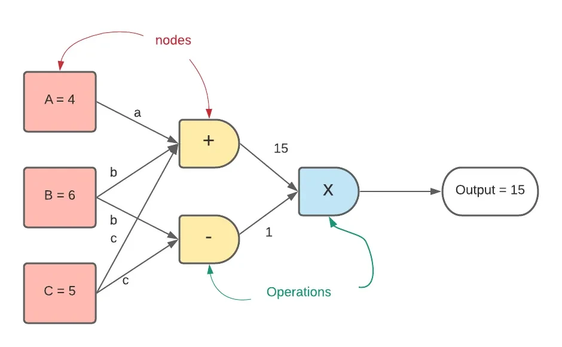

为了更好地理解接下来的内容，我们首先需要掌握基本的导数、梯度和链式法则等数学知识，如果有对此不是很熟悉的朋友，可以自行先学习相关的内容，我在下面的阐述中默认大家已经掌握，故不再赘述计算过程。

---

## 2.进一步了解计算图

### 2.1计算图结构与正向传播

计算图和我们学习过的数据结构中的图类似，它由代表变量（标量、向量、矩阵、张量或者其它）的**节点**以及代表函数关系或者数据依赖的**有向边**组成，节点之间通过有向边的连接组成运算。

现在我们以下面这个表达式举例说明计算图：

$$
e = (a + b)*(b + 1)
$$

我们可以将上述表达式“拆解”为下面3个子运算，分别是$a$与$b$的和、$b$与1的和以及这两个和的乘积，为了方便表示，我们引入中间变量$c$和$d$；

$$
c = f_{1}(a, b) = a + b
$$

$$
d = f_{2}(b) = b + 1
$$

$$
e = f_{3}(c, d) = c * d
$$

于是我们便可以绘制出对应运算的计算图并通过对输入变量取值来得到具体的输出结果。

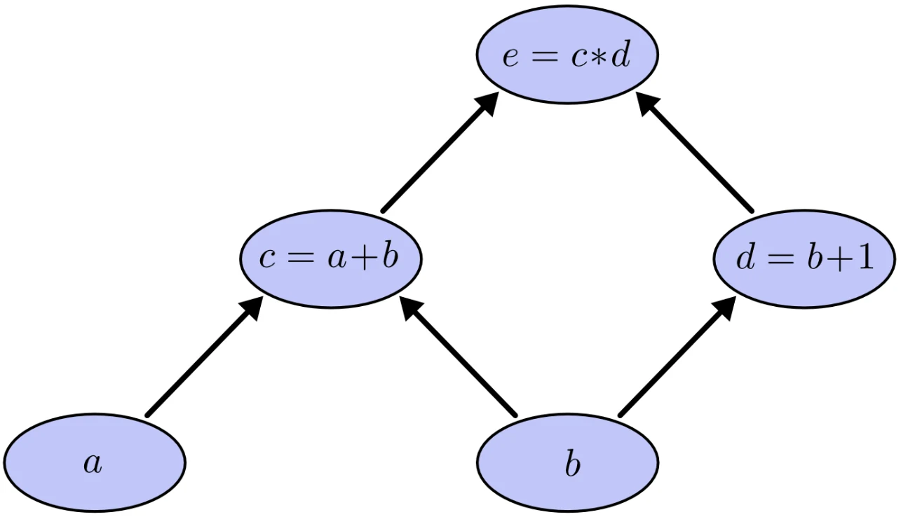

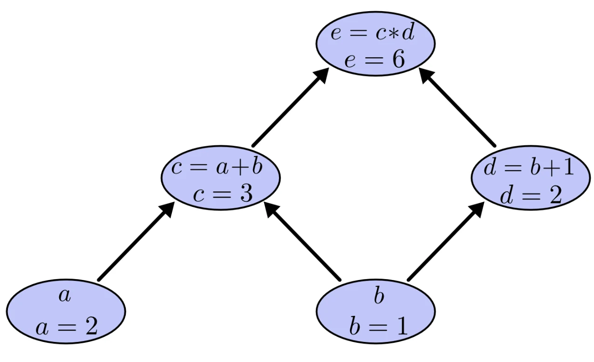

我们常见的计算图主要分为正向传播(forward-propagation)和反向传播(backward-propagation)两大类，上面举的例子便是正向传播，它的思路是从组成“整体”的各个“局部”出发，经过一系列的运算连接从而得到最终的结果，而接下来要讲的反向传播的思路正好与其相反。

---

### 2.2梯度下降与反向传播

我们知道，神经网络的训练就是为了找出能够较好拟合数据的模型参数（也可以说成找出使损失函数值最小化的权重参数），那这些参数该如何确定呢？当然是由网络自己确定！

神经网络的出现就是为了在大数据背景下一定程度上解放人类的双手，但是在它自己确定参数的过程中需要人为设定一个损失函数来作为训练优化的方向（毕竟训练的好坏程度是通过人来进行评判的，所以需要让它朝着我们想要的方向走）。

常见的损失函数有均方误差（Mean Squared Error，MSE）、平均绝对误差（Mean Absolute Error，MAE）和交叉熵损失（Cross Entropy Error）等。

有了损失函数，我们便可以得到神经网络在每一次训练中的误差大小是多少（也就是可以得到损失值），根据误差大小与我们的期望之间的差异来对网络使用优化方法进行优化（即使用优化方法来更新模型参数），不断重复上述过程从而得到效果较好的模型参数，在这里我们最常用的优化方法就是梯度下降法（Gradient Descent）。

如果对梯度下降不熟的朋友可以先看一下这篇故事类的博客简单理解一下：[https://uegeek.com/171222DLN6-GradientDescent.html](https://uegeek.com/171222DLN6-GradientDescent.html)

如右图所示，一开始的时候模型的参数$w$是随机选取的，然后求出损失值对参数的偏导数$\frac{\partial L}{\partial w}$，通过反复迭代$w := w - \alpha \frac{\partial L}{\partial w}$来完成优化，其中$α$是用来控制优化幅度的学习率（Learning Rate）。在实践中，梯度下降最终得到的最小值极有可能是一个局部最小值而不是全局最小值，但是神经网络自身能够提供充足的数据表达能力，所以局部最小值一般可以比较接近全局最小值，损失值也会相应的小（由于通常情况下会存在多个局部最小值，我们往往更新不到全局最优解）。

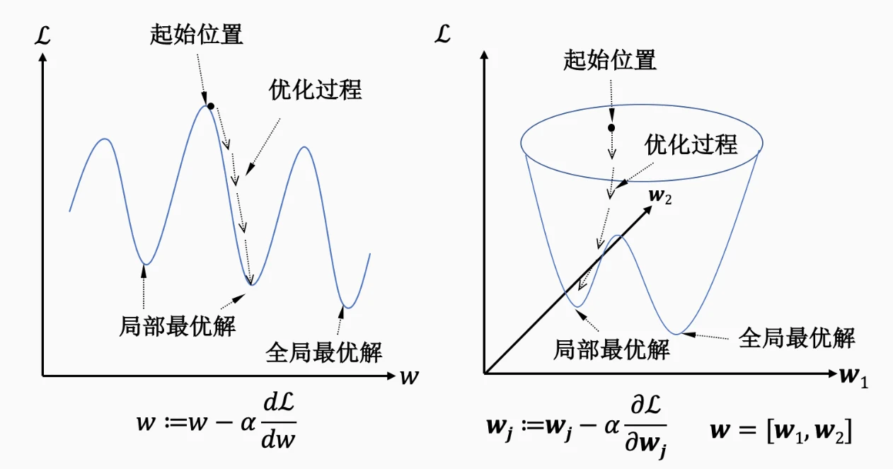

现在我们知道了常常使用梯度下降的方法来更新参数，现在问题就变成了如何在类似右图所示的神经网络中实现梯度下降呢？

答案就是利用反向传播算法来实现神经网络中的梯度下降！

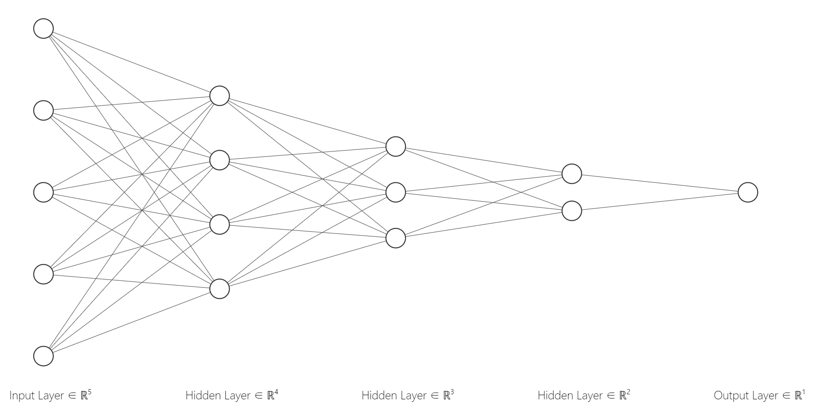

我们先来看看简单的单个节点（神经元）的反向传播。

1. 单个加法节点的反向传播图

假设现在有表达式$z = x + y$，则$z$对$x$和$y$的偏导数为$\frac{\partial z}{\partial x}=1$、$\frac{\partial z}{\partial y}=1$。

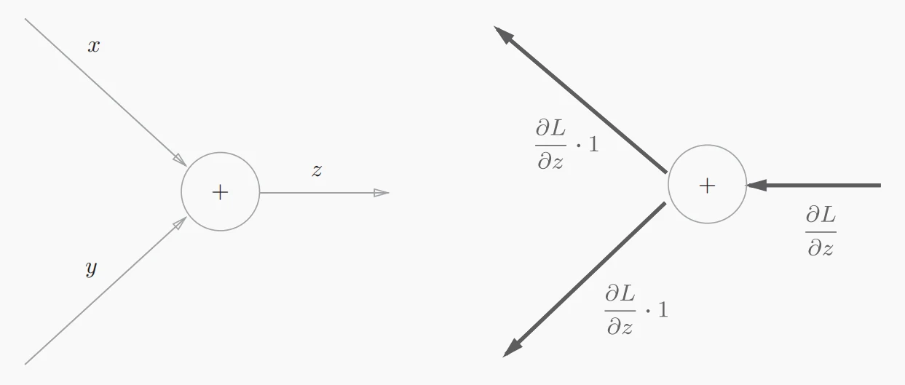

2. 单个乘法节点的反向传播图

假设现在有表达式$z = x*y$，则$z$对$x$和$y$的偏导数为$\frac{\partial z}{\partial x}=y$、$\frac{\partial z}{\partial y}=x$。

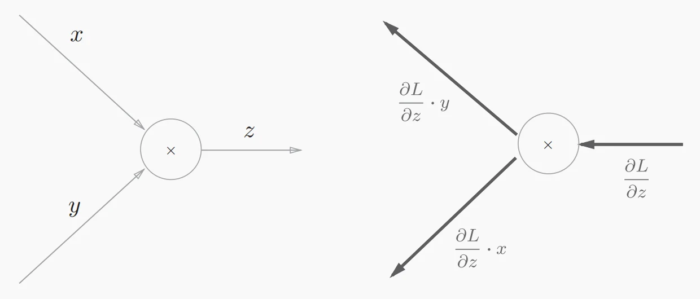

通过这两种比较简单的反向传播例子我们不难发现，加法节点的反向传播将上游（这里的“上游”是指以反向传播为顺序的上游）传来的导数乘1后传至下游，也就是说加法节点的反向传播输入值会原封不动的流向下一个节点；而乘法节点的反向传播会将上游的导数值乘以<strong>正向传播时的输入信号的“翻转值”</strong>后再传至下游节点。

接下来我们通过一个神经网络中常见的激活函数——Sigmoid函数的计算图来继续理解反向传播算法。

我们知道，Sigmoid函数的表达式如下，我们将这个式子“拆解”成使用正向传播计算图的表示形式。

$$
y = \frac{1}{1 + e^{-x}}
$$

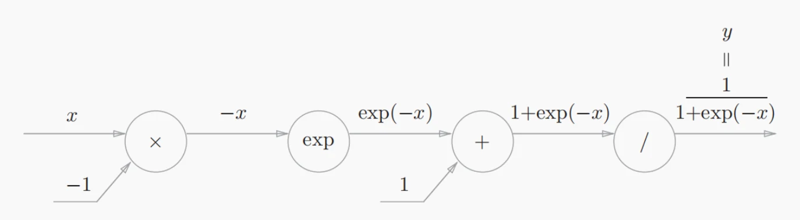

3. 接着我们主要关注它的反向传播过程，“/”节点表示$y=\frac{1}{x}$，它的导数为$\frac{\partial y}{\partial x} = -\frac{1}{x^2} = -y^2$。($\frac{1}{x^2} = y^2$)

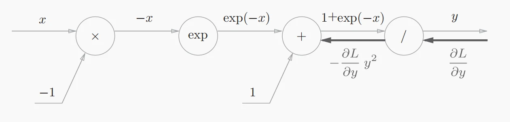

4. “+”节点将上游的值原封不动地传递给下游节点。

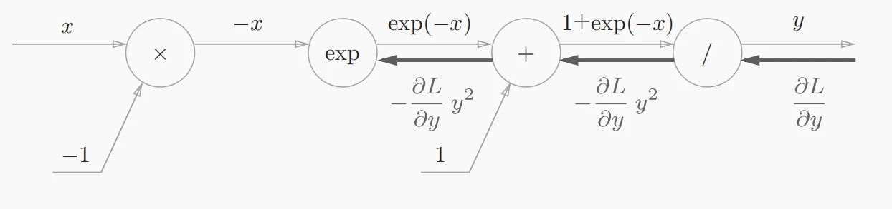

5. “exp”节点表示$y=e^{x}$，它的导数为$\frac{\partial y}{\partial x} = e^{x}$。

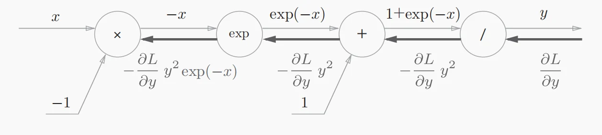

6. “×”节点将正向传播时的值“翻转”后做乘法运算。

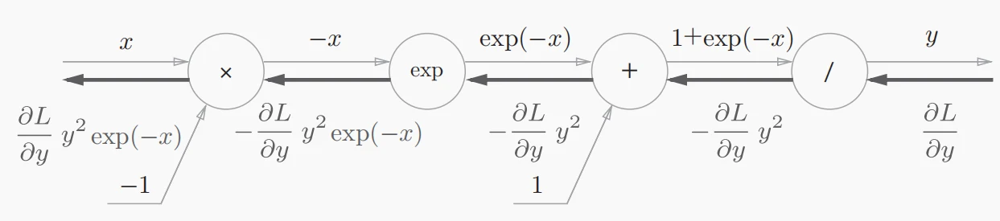

7. 经过整理后，Sigmoid函数的最终反向传播计算图如图所示。


至此，我们就能够很好地理解反向传播算法在神经网络中是如何进行梯度的传播了，虽然我们是以激活函数作为举例，但是损失函数的反向传播原理与其一致。

对于反向传播和前向传播之前的差别以及反向传播的高效性，以下这篇博客写的很好：

[https://colah.github.io/posts/2015-08-Backprop/](https://colah.github.io/posts/2015-08-Backprop/)

[https://www.vectorexplore.com/tech/backpropagation/](https://www.vectorexplore.com/tech/backpropagation/)

现在我们还有一个问题需要解决，那就是梯度下降时每更新一次参数，网络都需要计算一次当前参数下的损失值，当数据集很大的时候，如果每次更新都使用整个训练集来计算损失值的话计算量会变得十分巨大，这会导致模型的训练时间大大加长。为了减少计算量，我们使用随机梯度下降（Stochastic Gradient Descent，SGD）的方法来计算损失值。

具体来说，我们不使用全部的训练数据来计算损失值，而是从训练集中随机选取一些数据样本来计算损失值（比如选取16/32/64或者128个样本），此时我们称样本的数量为批大小（Batch Size）；此外，学习率的设定也十分重要，对于神经网络有关学习的技巧介绍将是我们下一次的探讨重点，敬请期待！

---

## 3.反向传播算法的实现

接下来我们通过一个简单的2×2×1（input-hidden-output）的神经网络（使用Sigmoid函数作为激活函数）来实现反向传播算法：

```python
import numpy as np

# Sigmoid 激活函数
def sigmoid(x):
    """
    Sigmoid函数用于将输入映射到0到1之间的值。
    :param x: 输入值，可以是标量、向量或矩阵
    :return: Sigmoid函数的输出
    """
    return 1 / (1 + np.exp(-x))

# Sigmoid函数的导数
def sigmoid_derivative(x):
    """
    计算Sigmoid函数的导数，导数公式为f(x) * (1 - f(x))，这里f(x)是Sigmoid的输出。
    用于反向传播时的梯度计算。
    :param x: Sigmoid函数的输出值
    :return: 对应的导数值
    """
    return x * (1 - x)

# 构建简单的神经网络结构
class SimpleNeuralNetwork:
    def __init__(self, input_size, hidden_size, output_size):
        """
        初始化神经网络的权重。
        :param input_size: 输入层的神经元数量
        :param hidden_size: 隐藏层的神经元数量
        :param output_size: 输出层的神经元数量
        """
        # 初始化权重（从输入层到隐藏层和从隐藏层到输出层）
        # 权重初始值为随机的小值，以便于进行梯度计算
        self.weights_input_hidden = np.random.randn(input_size, hidden_size)
        self.weights_hidden_output = np.random.randn(hidden_size, output_size)

    def forward(self, inputs):
        """
        前向传播过程。
        :param inputs: 输入数据（特征向量）
        :return: 输出层的激活值
        """
        # 计算隐藏层的输入值
        self.hidden_input = np.dot(inputs, self.weights_input_hidden)
        # 计算隐藏层的输出值（通过Sigmoid激活函数）
        self.hidden_output = sigmoid(self.hidden_input)

        # 计算输出层的输入值
        self.output_input = np.dot(self.hidden_output, self.weights_hidden_output)
        # 计算输出层的输出值（通过Sigmoid激活函数）
        self.output = sigmoid(self.output_input)

        return self.output

    def backward(self, inputs, target, learning_rate):
        """
        反向传播过程，计算误差并更新权重。
        :param inputs: 输入数据
        :param target: 期望输出（标签）
        :param learning_rate: 学习率，用于控制权重更新的幅度
        """
        # 计算输出层的误差（期望输出 - 实际输出）
        output_error = target - self.output
        # 计算输出层误差的梯度（通过Sigmoid导数）
        output_delta = output_error * sigmoid_derivative(self.output)

        # 计算隐藏层的误差（输出层误差反向传递到隐藏层）
        hidden_error = np.dot(output_delta, self.weights_hidden_output.T)
        # 计算隐藏层误差的梯度（通过Sigmoid导数）
        hidden_delta = hidden_error * sigmoid_derivative(self.hidden_output)

        # 更新权重（梯度下降法）
        # 更新从隐藏层到输出层的权重
        self.weights_hidden_output += np.dot(self.hidden_output.T, output_delta) * learning_rate
        # 更新从输入层到隐藏层的权重
        self.weights_input_hidden += np.dot(inputs.T, hidden_delta) * learning_rate

# 数据准备
# 假设我们有一个简单的二分类问题，输入为两个特征，输出为0或1
inputs = np.array([[0, 0],
                   [0, 1],
                   [1, 0],
                   [1, 1]])

# 目标输出（标签），逻辑与操作的结果
targets = np.array([[0],
                    [1],
                    [1],
                    [0]])

# 创建神经网络实例
nn = SimpleNeuralNetwork(input_size=2, hidden_size=2, output_size=1)

# 训练网络
epochs = 10000
learning_rate = 0.1
for epoch in range(epochs):
    # 前向传播
    output = nn.forward(inputs)
    # 反向传播和权重更新
    nn.backward(inputs, targets, learning_rate)

    # 打印每1000次迭代的损失值
    if epoch % 1000 == 0:
        loss = np.mean(np.square(targets - output))
        print(f'Epoch {epoch}, Loss: {loss}')

# 测试神经网络
print("\n最终输出结果：")
print(nn.forward(inputs))
```

> [!NOTE]
> 最终输出结果：\[\[0.20887465\], \[0.73158328\], \[0.73156845\], \[0.34926774\]\]’

---

## **Reference**

[https://www.cs.cmu.edu/~aarti/Class/10315_Spring22/315S22_Rec6.pdf](https://www.cs.cmu.edu/~aarti/Class/10315_Spring22/315S22_Rec6.pdf)

[https://www.geeksforgeeks.org/computational-graphs-in-deep-learning/](https://www.geeksforgeeks.org/computational-graphs-in-deep-learning/)

[https://simple-english-machine-learning.readthedocs.io/en/latest/neural-networks/computational-graphs.html](https://simple-english-machine-learning.readthedocs.io/en/latest/neural-networks/computational-graphs.html)

[https://openmlsys.github.io/appendix_machine_learning_introduction/gradient_descent.html](https://openmlsys.github.io/appendix_machine_learning_introduction/gradient_descent.html)
