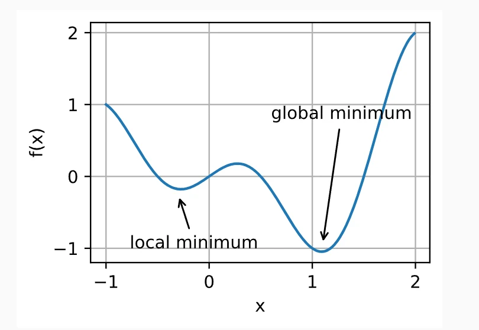
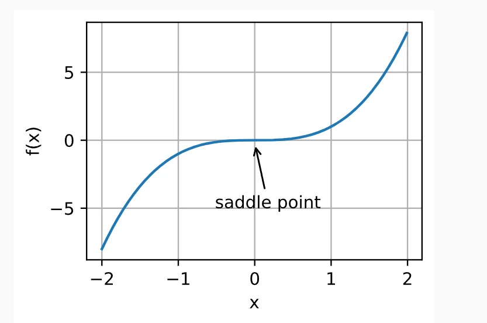
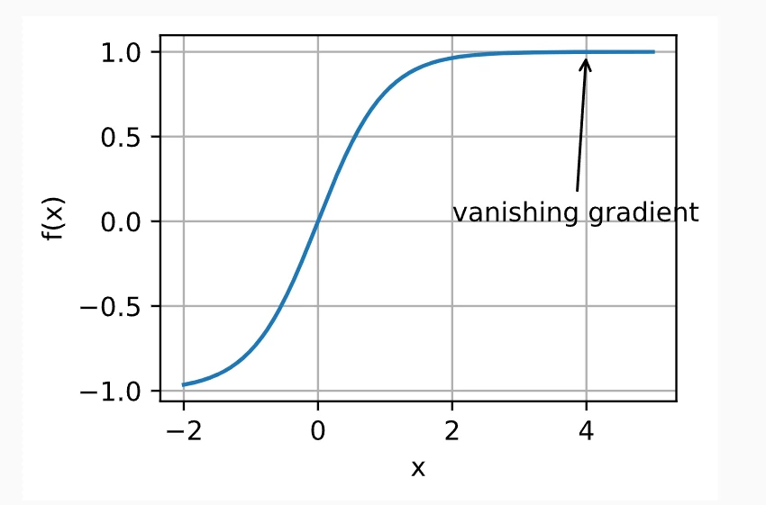
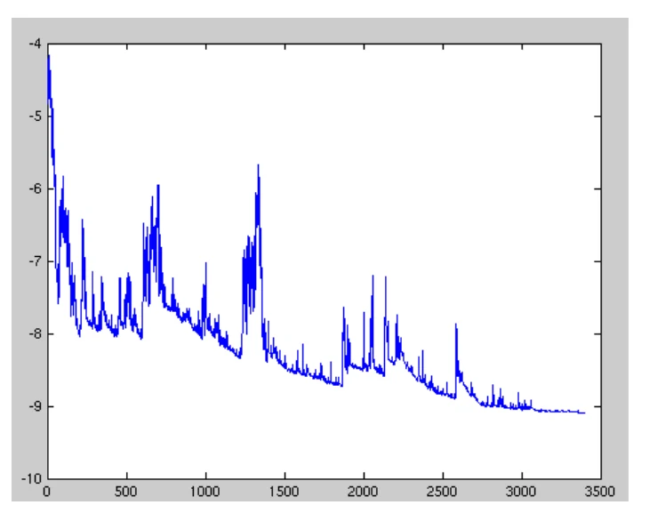
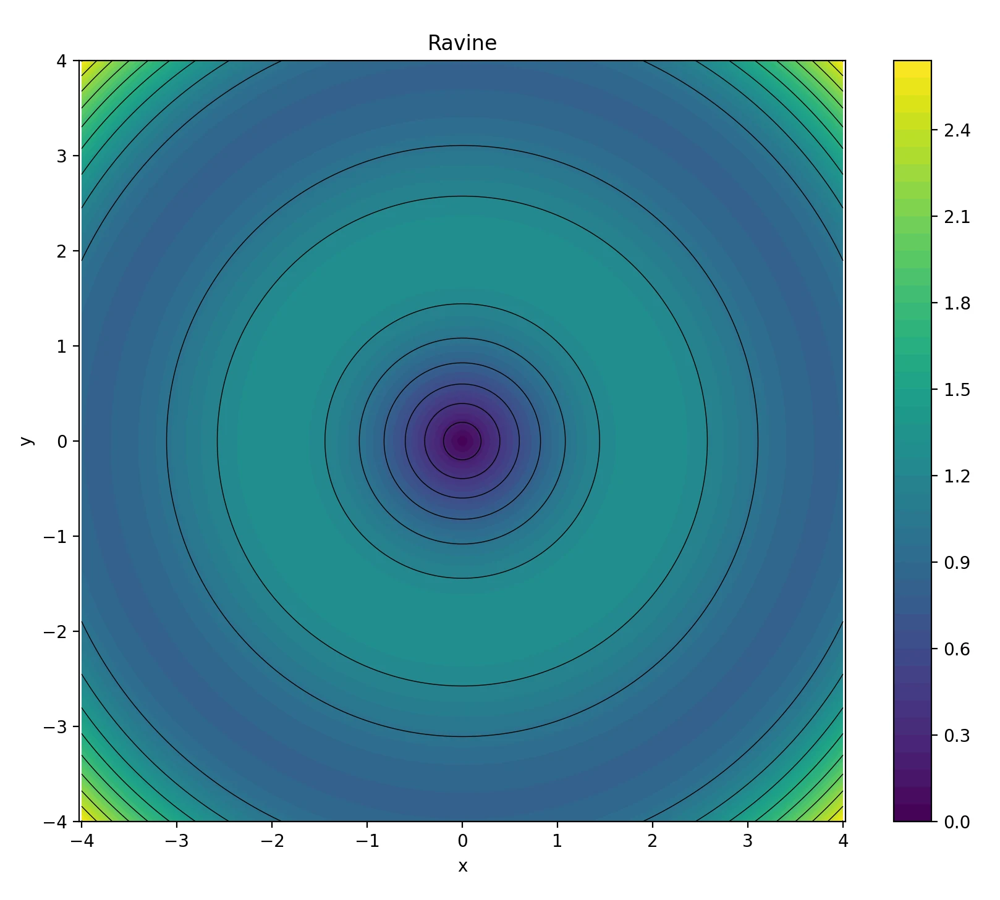
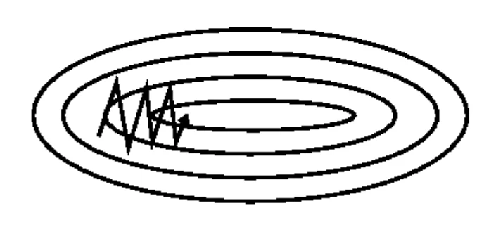
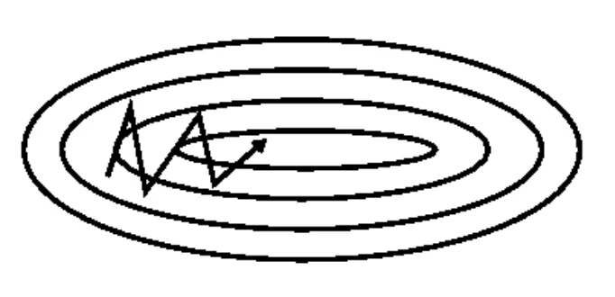
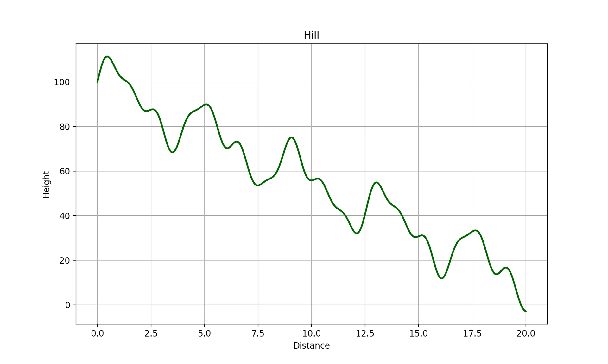
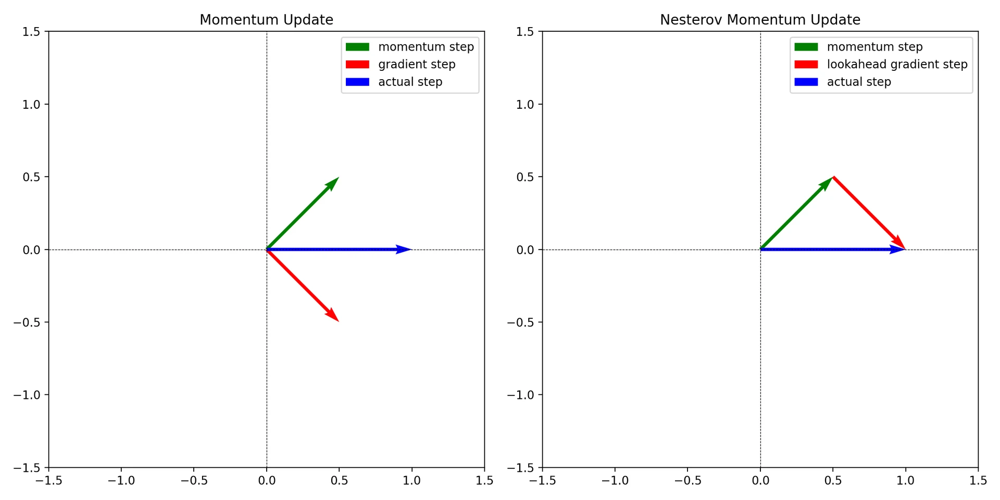

我们知道，在有关深度学习的问题中，我们会定义损失函数（Loss Function）来衡量模型的表现程度，训练网络的目标就是找出使损失函数值最小化的参数，那如何使损失函数值达到最小化呢？通常我们使用优化算法来尝试最小化损失，所以损失函数被称为优化问题的目标函数（从优化的角度讲）。大部分优化算法关注的是最小化问题，如果我们需要最大化目标，只需要在目标函数前加上负号即可。

在这里尤其需要注意区分深度学习和优化二者之间的目标差异性，尽管优化为我们提供了一种最大限度地减少深度学习损失函数值的方法，但从本质上看：优化仅仅关注的是最小化目标（损失函数值），而深度学习关注的是在一定数据量下寻找符合问题的模型架构。（由于优化算法的目标函数通常是基于训练数据集的损失函数，因此可以理解为优化的目标是减少训练误差，而深度学习的目标是减少包括未知数据集在内的泛化误差。）

在优化的过程中我们通常会遇到一些常见的问题，比如非凸、局部最小值、鞍点、梯度消失等，针对不同类型的问题有对应的优化算法来进行优化。从优化过程中梯度的角度来看，目前流行的优化方法主要分为三类：以广泛使用的随机梯度方法为代表的一阶优化方法（First-Order Methods）、以牛顿法为典型代表的高阶优化方法（High-Order Methods）以及以坐标下降法为代表的启发式无导数优化方法（Derivative-Free Methods）。

因为关于优化方法的内容纷繁多样，我们在这里主要介绍以广泛使用的随机梯度方法为代表的一阶优化方法，其它两类方法大家感兴趣的话可自行学习。

---

## 一、梯度下降及其几种简单的变体

在深度学习的神经网络中，除了网络的结构图外，我们最熟悉的莫过于反向传播过程了，梯度下降（Gradient Descent）便是建立在反向传播的基础之上的。尽管现在的深度学习很少直接使用梯度下降来进行优化，但它是诸多其它常用方法的先验知识，所以我们有必要先来了解一下梯度下降及其几种简单的变体。

### 1.Batch Gradient Descent

又名Vanilla Gradient Descent，它是最早和最常见的优化方法，其思想是参数在目标函数梯度的（相反）方向上迭代更新直至收敛到目标函数的最优值。批量梯度下降（BGD）通过计算整个训练集参数$θ$的梯度来进行参数更新，公式中的$\eta$代表学习率（Learning Rate），它决定了每次迭代的步长，进而影响达到最优值的迭代次数；$\nabla_\theta J(\theta)$代表所有训练数据的梯度，每次更新参数时都会使用**整个训练集**进行计算，所以我们称之为批量梯度下降。

$$
\theta^{'} = \theta - \eta \cdot \nabla_\theta J(\theta)
$$

最陡下降算法（Steepest Descent Algorithm）也是一种广为人知的算法，它的思想是在每次迭代中选择合适的搜索方向来使目标函数的值以最快的速度最小化，但我们需要将它和批量梯度下降区分开来，因为负梯度的方向并不总是下降的最快。

对于**凸性问题（Convexity）**$^{1}$我们可以保证批量梯度下降方法能够收敛至全局最小值，对于非凸问题则收敛至局部最小值，但是由于我们需要计算整个数据集的梯度才能执行一次参数更新，当数据集比较大时（情况往往是这样），批量梯度下降方法的更新速度会变得十分缓慢，并且它也不允许我们**在线更新（Online Update）**$^{2}$参数。

> 1：凸函数具有“局部最小值即是全局最小值”这个性质。
>
> 2：在线更新指的是每次使用一个样本或小批量样本（mini-batch）来计算梯度并立即更新模型参数，而不是等所有样本的梯度都计算完之后才进行更新。

---

### 2.Stochastic Gradient Descent

由于批量梯度下降在大规模数据的每次迭代中具有很高的计算复杂度并且不支持在线更新，于是随机梯度下降（SGD）应运而生。
公式中的$x^{(i)}$和$y^{(i)}$表示第$i$个样本的数据$x^{(i)}$和标签$y^{(i)}$，损失函数$J(\theta; x^{(i)}; y^{(i)})$是针对单个样本$(x^{(i)}, y^{(i)})$来进行计算的，这意味着$\nabla_\theta J(\theta; x^{(i)}; y^{(i)})$表示损失函数在单个样本上的梯度。

$$
\theta^{'} = \theta - \eta \cdot \nabla_\theta J(\theta; x^{(i)}; y^{(i)})
$$

批量梯度下降在每次参数更新之前都会重新计算相类似的梯度，而随机梯度下降是随机使用一个样本来更新每次迭代的梯度（计算一次便立即更新，无需等到所有梯度都计算完毕），因此随机梯度下降算法的成本与样本数量无关，它减少了处理大量样本的更新时间并消除了一定的计算冗余，可以进行在线更新。

然而，由于随机选择这个特点，我们引入了额外的**噪声**3，这会导致在梯度方向出现**震荡**4问题（**随机梯度下降执行具有高方差的频繁更新，造成目标函数出现大幅波动**5），并且搜索过程在解决方案空间中是盲目的；不过相比于BGD中的确定性梯度可能会导致目标函数落入局部最小值，SGD的这种波动有助于目标函数跳出局部最小值（虽然或多或少会减慢收敛过程）。

> 3：这里的“噪声”指的是由于随机选择样本以计算梯度而引入的随机性或不确定性，这种随机性影响梯度的计算从而影响了优化过程。
>
> 4：“震荡”指的是由于噪声引起的目标函数在优化过程中波动的现象，在SGD中，目标函数值可能在最优值附近来回摆动，很难稳定在一个较小的损失值，这种震荡可能使得搜索过程难以收敛到最优解或者在某些情况下导致参数在局部最优解附近反复徘徊而不收敛。
>
> 5：在SGD中，每次更新参数时使用的样本是数据集中的随机样本，这就可能导致不同的样本之间的梯度相差很大，从而导致参数更新的变化比较大（高方差），由于它在每一个样本上进行参数更新，这意味着我们在较短的时间内会进行多次更新（频繁性）；由于SGD在每一步都可能因为随机选择的样本而导致大的参数更新幅度，这会使得损失函数（目标函数）的值出现显著波动，例如有时它可能会迅速下降，有时又会迅速上升（波动性）。

---

### 3.Mini-batch Gradient Descent

针对BGD的计算复杂度问题和SGD的震荡性问题，人们提出了一种在二者之间折中的方案——小批量梯度下降方法（MSGD）。

在公式中，小批量梯度下降方法每次计算从$i$到$i+n$这$n$个训练样本的梯度并进行参数更新，这一方法既减少了梯度的方差，使得收敛更加稳定，又不必计算所有样本数据的梯度，有助于提高优化速度；在后面的叙述中我们默认称MSGD为SGD，并且省略参数$x^{(i:i+n)}; y^{(i:i+n)}$以求简便性。

$$
\theta^{'} = \theta - \eta \cdot \nabla_\theta J(\theta; x^{(i:i+n)}; y^{(i:i+n)})
$$

常见的小批量大小在50-256之间，但也因实际应用而异，在训练神经网络时，小批量梯度下降通常作为首选算法。但是在使用SGD时我们仍然会遭遇如下常见的问题：

- 选取合适的学习率可能比较困难，太小的学习率会导致收敛速度非常慢，太大的学习率则会阻碍收敛并导致损失函数在最小值附近波动甚至发散。

- 当设置预定义的学习率列表来调整学习率或者当Epoch之间的目标变化低于阈值时调整学习率时，学习率列表和阈值必须人为提前定义，无法良好地适应数据集的特性。

- 如果对所有参数应用相同的学习率也是不合适的，当数据稀疏并且数据特征以不同的频率出现时尤其如此，对于不太频繁出现的特征我们通常预期使用更高的学习率以执行更大的更新。

- 除了学习率之外，如何避免目标函数被困在无限数量的局部最小值也是一个常见的挑战（一些研究证明这种挑战不是来自局部最小值而是鞍点问题）。

---

## 二、其它常见的梯度下降有关算法

### 1.Momentum (SGD-Momentum)

在优化问题中，我们通常会遇到一个术语——沟壑（Ravine），它指的是目标函数在某些维度上变化非常陡峭的区域，这种情况通常发生在局部最优解附近，导致梯度在某些方向上变化很大，而在其他方向上变化很小（即更新方向不一致）。

而SGD遇到这种情况时很难有效地进行优化（当它梯度计算处于不稳定状态时，可以近似看作陷入了沟壑），在沟壑中，SGD可能会在陡峭的“斜坡”上来回震荡而不是朝着局部最优解稳定前进，这种震荡使得SGD在接近**目标函数的底部**6时出现犹豫不决的情况（这将会导致收敛速度显著减慢）。

为了解决这个问题，人们在SGD的基础上引入了动量（Momentum）。动量是一种有助于在相关方向上加速SGD并抑制震荡的方法，它通过将过去时间步长中更新的一部分（$γ$倍）与当前的梯度结合，使得当前的参数更新不仅依赖于最新的信息，还考虑了过去的历史信息（类似于现实生活中物体运动所具有的惯性）。

由于动量考虑了先前的更新方向和大小，相比于简单的梯度更新，动量更新能够在陡峭地形中取得更为平稳的走向和减少由于梯度波动带来的震荡，使得算法在收敛到目标时更为稳定；在一些形状较为复杂的损失函数中，动量可以帮助优化算法更快地向最优解收敛。

在公式中，$v_t$表示在时间步$t$的动量值（即速度），它是当前参数更新的方向和大小的组合，$v_{t-1}$是在时间步$t-1$的动量值；$γ$是动量衰减因子（通常取值在0-1之间,一般取0.9为佳），它控制前一时刻动量对当前速度的影响，较高的值意味着前一时刻的动量在当前更新中占据较大的比重。

$$
v_t = \gamma v_{t-1} + \eta \nabla_\theta J(\theta)
$$

$$
\theta^{'} = \theta - v_t
$$

> [!NOTE]
> 接下来我们举一个有趣的例子来理解上述过程：
>
> 假设我们需要从山坡上滚落一个雪球，不平坦的雪地代表着我们的目标函数上下起伏的状态，雪球代表着我们的优化过程，雪球的大小和速度代表动量，山坡底部代表最优值。
>
> 开始时小雪球开始滚动并且起始位置不在山坡底部，这时候雪球很小、速度很慢，它的滚动会受到地形的影响，可能会在地形凹陷处发生“停滞”；
>
> 随着雪球不断吸附周围的雪，它开始变得越来越大，滚动的速度也越来越快，这就好比动量$v_t$的累积；
>
> 如果我们在某个时间点施加给它一个推力，雪球会以更快的速度继续滚动，因为它不仅受到当前推力的影响，还累积了之前的动量$v_{t-1}$；
>
> 当雪球滚动到坡度更陡的地方时，由于动量的累积，雪球会加速下滑向着坡底快速前进；由于动量的影响，即使雪球运动到了凹陷处，它也不会停下来，而是凭借着足够的速度和重量继续向前滚动，最终越过沟壑向着坡底运动。

> 6：“目标函数的底部”是指从目标函数的图像上来看损失值最低的区域，它是我们希望通过优化算法找到的地方，可能是全局最优解或者局部最优解。

---

### 2.Nesterov Accelerated Gradient

正如我们在上一个方法中举的滚雪球这个形象的例子中一样，如果此时山坡从坡顶到坡底这一段路程具有多个“S”型的小坡，那么一味地沿着雪球现在的运动方向增加动量这种惯性可能会使雪球“飞出”，为了避免这种情况发生，我们需要让雪球能够在再次上坡时放慢速度而不会飞出。

涅斯捷罗夫加速梯度方法（NAG）通过计算$\theta - \gamma v_{t-1}$预测当前参数沿着动量方向的下一个近似位置，使用这个预测的近似位置的梯度与当前参数的动量结合作为实际更新的梯度，这种“预测”的方法能够让我们更好地基于历史信息评估新的梯度方向。公式中的$\gamma v_{t-1}$代表当前参数位置$θ$的动量，$\theta - \gamma v_{t-1}$7代表基于当前参数位置沿着动量方向预测得到的未来位置。

$$
v_t = \gamma v_{t-1} + \eta \nabla_\theta J(\theta - \gamma v_{t-1})
$$

$$
\theta^{'} = \theta - v_t
$$

> 7：在优化问题中，梯度下降算法通过梯度的反方向来减少目标函数的值，为了实现这一点，NAG选择减去$\gamma v_{t-1}$来得到一个“预测位置”，使用减号让我们在动量的方向上先行试探，相当于去探测一个更远的点的梯度信息，如果这个位置确实靠近最小值点，那么我们就可以通过当前的梯度信息更为准确地修正参数。

---

在前面提到的优化方法中，我们针对的大多是梯度方向的优化，而没有过多关注学习率$\eta$这个超参数，事实上，手动调节的学习率会极大地影响SGD方法的实际效果，设置合适的学习率是一个非常棘手的问题。下列方法提出了一些自适应技巧来自动调节学习率，这些方法通常无需过多调整参数、收敛速度快并且可以取得不错的效果，它们广泛用于深度神经网络中来处理优化问题。

### 3.Adagrad

Adagrad是一种基于梯度的优化算法，它根据参数来自动调整学习率，对不频繁的参数执行较大的更新，对频繁的参数执行较小的更新，因此Adagrad非常适合处理**稀疏数据**8。

先前，每个参数$\theta _i$都使用相同的学习率$\eta$来进行更新，由于Adagrad在每个时间步$t$对每个参数$\theta _i$使用不同的学习率，因此我们首先将Adagrad每个参数更新使用数学式表示出来，然后将其矢量化。为简洁起见，我们将$g_{t,i}$表示为目标函数在时间步$t$对参数$\theta _i$的梯度。

$$
g_{t,i} = \nabla_{\theta_t} J(\theta_{t,i})
$$

对于SGD，参数更新公式就变成了：

$$
\theta_{t+1,i} = \theta_{t,i} - \eta \cdot g_{t,i}
$$

而Adagrad的参数更新公式如下所示，其中$G_t$是一个对角矩阵，矩阵中的每个对角元素$G_{t,ii}$表示在第$i$个位置上过去所有梯度的平方和，即$G_{t,ii} = \sum_{\tau=1}^{t} g_{\tau,i}^2$，对频繁更新参数而言，这个平方和会逐渐变大使得学习率$\eta^{'} = \frac{\eta}{\sqrt{G_{t,ii} + \epsilon}}$自动减小，这使得那些经常变化的参数（即梯度大的参数）更新步长较小，从而防止过度更新，反之亦然；$\epsilon$表示一个极小量（也称为平滑项），它的作用是避免分母为零；至于为什么要在分母位置加上根号，一些研究表明该算法如果缺少平方根运算的性能要比有差得多。

$$
\theta_{t+1,i} = \theta_{t,i} - \frac{\eta}{\sqrt{G_{t,ii} + \epsilon}} \cdot g_{t,i}
$$

上面这个公式可以进一步简化成下面这种形式，其中$\odot$代表向量化后的矩阵乘法运算，我们通常在实际运用中将$\eta$的默认值设为0.01。

$$
\theta_{t+1} = \theta_t - \frac{\eta}{\sqrt{G_t + \epsilon}} \odot g_t
$$

不难发现，Adagrad的最大优点就是在参数更新的过程中我们无需再手动调整学习率，它通过使用截止至目前迭代累积的所有历史梯度自动计算得到；但是Adagrad的缺点也很明显，随着训练时间的增加，累积的梯度会越来越大，这会使得公式中的分母项越来越大从而使得$\frac{\eta}{\sqrt{G_t + \epsilon}}$越来越小甚至趋于0，最终导致参数更新无效。

> 8：稀疏数据是指在高维空间中的数据集包含大量的特征（即维度），但大部分特征中数据点的值为0或缺失，这会导致有效信息的比例相对较低，造成“稀疏性”。

---

### 4.Adadelta

为了解决Adagrad方法中学习率随着梯度的累积不断减小的问题，人们提出了Adadelta方法。Adadelta是Adagrad方法的扩展，相比于Adagrad累积过去所有的梯度平方，Adadelta将累积的过去梯度限制为某个固定的窗口大小，其中累积的过去梯度不是这个窗口中的梯度平方和，而是递归地定义为梯度平方的**衰减平均值**9。

公式中的$E[g^2]_{t-1}$表示梯度平方的衰减平均值，仅取决于前一时间步的平均值和当前梯度；$γ$与先前提到的动量衰减因子作用类似，控制更新的“平滑程度”，一般设为0.9，$γ$取值越大意味着对历史梯度信息依赖更大，更新更为平稳，取值越小则更依赖于当前的梯度信息。

$$
E[g^2]_t = \gamma E[g^2]_{t-1} + (1 - \gamma) g_t^2
$$

为了理解Adadelta中“delta”的含义，我们首先来使用$\Delta$对先前一些方法进行重新定义。对于SGD和Adagrad方法，重新定义后的式子如下：

$$
\begin{aligned}
\Delta \theta_t = -\eta \cdot g_{t,i} \\
\theta_{t+1} = \theta_t + \Delta \theta_t
\end{aligned}
$$

$$
\begin{aligned}
\Delta \theta_t = - \frac {\eta} {\sqrt{G_t+\epsilon}} \odot g_t \\
\theta_{t+1} = \theta_t + \Delta \theta_t
\end{aligned}
$$

现在对于Adadelta中的参数更新变化量，我们只需要将Adagrad中的对角矩阵$G_t$替换为过去梯度平方的衰减平均值$E[g^2]_t$即可。

$$
\Delta \theta_t = - \frac {\eta} {\sqrt{E[g^2]_t + \epsilon}} \cdot g_t
$$

由于此时公式中的分母满足均方根（Root Mean Square）格式，我们也可以将公式写成如下标准简写形式。

$$
\Delta \theta_t = - \frac {\eta} {\text{RMS}[g]_t} \cdot g_t
$$

但是现在我们还不能将其作为最终的参数更新公式，因为上述式子出现了**单位不一致**$^{10}$的问题。为了解决这个问题，我们采用对更新参数平方进行衰减平均值和均方根处理（即对$\Delta \theta_t$本身进行类似的指数衰减平方平均处理）。

$$
E[\Delta \theta^2]_t = \gamma E[\Delta \theta^2]_{t-1} + (1 - \gamma) \Delta \theta^2
$$

$$
\text{RMS}[\Delta \theta]_t = \sqrt{E[\Delta \theta^2]_t + \epsilon}
$$

由于$\text{RMS}[\Delta \theta]_t$是未知的（在实际计算时，$\Delta\theta_t$是我们希望得到的本次参数更新量，而我们无法在更新前就知道它的值），因此我们将它与上一时间步更新参数的RMS值进行近似，将原来公式中的学习率$\eta$替换为$\text{RMS}[\Delta \theta]_{t-1}$并得到最终的参数更新公式。从这个式子中我们不难看出使用Adadelta方法不需要人为地设置默认学习率，它已经在参数更新公式中被消除了。

$$
\Delta \theta_t = - \frac {\text{RMS}[\Delta \theta]_{t-1}} {\text{RMS}[g]_t} \cdot g_t
$$

$$
\theta_{t+1} = \theta_t + \Delta \theta_t
$$

> 9：也称为指数加权移动平均（Exponentially Weighted Moving Average），是一种用来平滑数据的方法，它通过给较新的数据点赋予高权重、较旧的数据点赋予低权重来实现（这里的“高”、“低”指一般情况，并不绝对）。
> 10：在传统的SGD中，更新公式为$\Delta \theta_t = -\eta \cdot g_{t,i}$，这里的学习率$\eta$在单位上通常是一个无量纲的比例因子，因此更新量$\Delta \theta_t$的单位与$g_{t,i}$的单位相同；而在Adadelta方法中，我们使用的公式$\Delta \theta_t = - \frac {\eta} {\sqrt{E[g^2]_t + \epsilon}} \cdot g_t$中的分母$\sqrt{E[g^2]_t + \epsilon}$是梯度平方的均方根，它的单位和$g_t$的单位相同，经过公式运算过后会使得$\Delta \theta_t$的单位与学习率$\eta$的单位保持一致（即使$\eta$一般无量纲），而不再与模型中的参数$\theta$的单位保持一致，这种不一致使得参数更新量没有合适的尺度去表示参数的变化而只能从数值大小上体现。

---

### 5.RMSprop

有趣的是，RMSprop算法是Geoffrey Hinton于2012年左右在他的深度学习课程中提出的一种未在正式论文发表情况下的自适应学习率算法$^{11}$，这个算法实际上与我们介绍的Adadelta算法同出一辙（先有RMSprop，然后Adadelta基于此思想被提出）。

公式主要分为两部分，一部分是梯度平方的指数加权移动平均，一部分是参数更新公式；其中平滑系数$\gamma$建议设置为0.9，学习率$\eta$的默认值为0.001。

$$
E[g^2]_t = 0.9 E[g^2]_{t-1} + 0.1 g_t^2
$$

$$
\theta_{t+1} = \theta_t - \frac{\eta} {\sqrt{E[g^2]_t + \epsilon}} \cdot g_t
$$

> 11：[https://www.cs.toronto.edu/~tijmen/csc321/slides/lecture_slides_lec6.pdf](https://www.cs.toronto.edu/~tijmen/csc321/slides/lecture_slides_lec6.pdf)

---

### 6.Adam

自适应矩估计（Adaptive Moment Estimation）是另一种常用的计算每个参数的自适应学习率的优化算法，它综合动量法和自适应学习率方法的思想以实现对梯度的一阶与二阶动量估计，从而更加有效地优化神经网络的参数。Adam算法的核心是分别追踪每个参数梯度的**一阶矩（均值）和二阶矩（非中心方差）**$^{12}$，并对它们进行偏差校正以避免训练初期的梯度信息被过低估计。

在算法的第一部分公式中，$g_t$代表当前时间步$t$的梯度；$m_t$是梯度的一阶矩估计，它类似于动量法中的速度项，衰减系数$\beta_1$决定了过去梯度对当前动量的影响，通常设为0.9；$v_t$是梯度的二阶矩估计，它相当于RMSprop方法中的均方根项，衰减系数$\beta_2$通常取0.999，它控制着过去的梯度平方对当前估计的影响。

$$
\begin{aligned}
m_t = \beta_1 m_{t-1} + (1 - \beta_1) g_t \\
v_t = \beta_2 v_{t-1} + (1 - \beta_2) g_t^2
\end{aligned}
$$

但是Adam算法在初始阶段的$m_t$和$v_t$往往会偏向于零（因为$\beta_1$、$\beta_2$一般取接近1的数，这时$1-\beta_1$、$1-\beta_2$便会很小；在初始阶段由于$m_{t-1}$、$v_{t-1}$都很小，这将导致$m_t$、$v_t$容易低估真实的梯度统计量$g_t$和$g_t^2$，这种偏小的估计会导致算法更新幅度不够准确从而影响训练效果），为了减轻这种初始偏向，人们引入了偏差校正操作。

在算法第二部分的偏差校正公式中，$\hat m_t$和$\hat v_t$表示偏差校正后的估计量，$\beta_1^t$和$\beta_2^t$为衰减系数的$t$次幂，它们会随着迭代次数的增加而减小到接近1。 当$t$很小时，$\beta_1^t$和$\beta_2^t$还没有接近1，因此$1-\beta_1^t$和$1-\beta_2^t$的值较小，通过将$m_t$和$v_t$除以这个较小的因子，放大了初始的$m_t$和$v_t$的值，使得它们更加接近真实值；随着$t$的增大，$1-\beta_1^t$和$1-\beta_2^t$趋近于1，校正效果逐渐减弱，最终对稳定后的$m_t$和$v_t$不再有影响。

$$
\begin{aligned}
\hat{m}_t = \frac {m_t} {1 - \beta_1^t} \\
\hat{v}_t = \frac {v_t} {1 - \beta_2^t}
\end{aligned}
$$

在算法的最后部分，Adam使用和先前Adadelta、RMSprop方法类似的参数更新公式，其中平滑项$\epsilon$一般取$10^{-8}$。

$$
\theta_{t+1} = \theta_t - \frac{\eta}  {\sqrt{\hat{v}_t} + \epsilon}\cdot \hat{m}_t
$$

> 12：一阶矩和二阶矩是统计学和信号处理等领域中用于描述分布特征的重要概念，一阶矩通常指的是随机变量的期望值（均值），它反映了数据分布的中心位置；二阶矩通常指的是随机变量的方差，它反映了数据分布的离散程度或变异性；非中心方差是指随机变量平方的期望值。

---

## 三、Conclusion & Reference

[https://arxiv.org/abs/1609.04747](https://arxiv.org/abs/1609.04747)

[https://arxiv.org/abs/1906.06821](https://arxiv.org/abs/1906.06821)

[https://cs231n.github.io/neural-networks-3/](https://cs231n.github.io/neural-networks-3/)

[https://zh.d2l.ai/chapter_optimization/index.html](https://zh.d2l.ai/chapter_optimization/index.html)

[https://zhuanlan.zhihu.com/p/32230623](https://zhuanlan.zhihu.com/p/32230623)
