> [!NOTE]
> 在本篇笔记中，我将展示基于爬虫框架Scrapy来对[**Quotes**](https://quotes.toscrape.com/)中的名人名言以及[**某工管理学院官网**](https://glxy.gdut.edu.cn/)中的教师信息进行批量爬取。

> 本次爬取的学习素材和思路来自崔庆才编著的Python3WebSpider以及上次挖的坑。

## 一、Quotes中的名人名言爬取

在使用Scrapy框架进行网页爬取之前，我们首先需要在本地安装好Scrapy这个库，具体的安装和配置教程各大平台均有，这里我便不再赘述。

### 1.使用命令行创建Scrapy项目

由于Scrapy框架和我们之前讲过的Pyspider框架不同，它通过命令行工具来进行项目的创建，具体的爬取逻辑仍然需要借助计算机中的编程环境（IDE），最后通过命令行进行爬取操作的指令输入。

我们首先打开本地命令行的窗口并将路径切换为自己想要创建的项目位置（我这里将项目创建至D盘）：

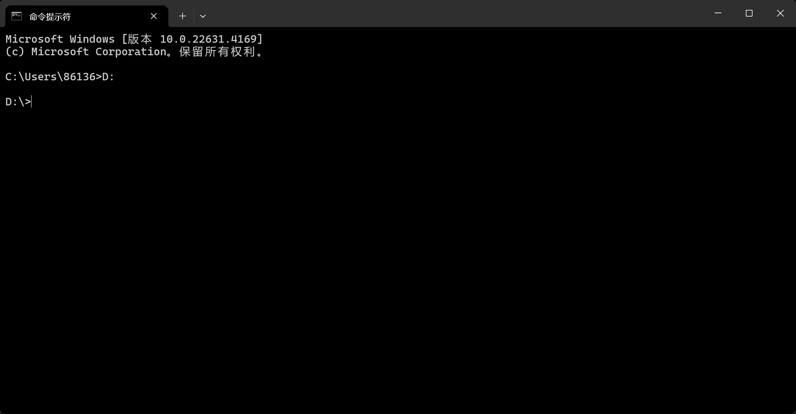

接着在命令行窗口输入如下命令以创建一个名为quotes_project的项目，命令行会出现如下所示的界面：

```bash
scrapy startproject quotes_project
```

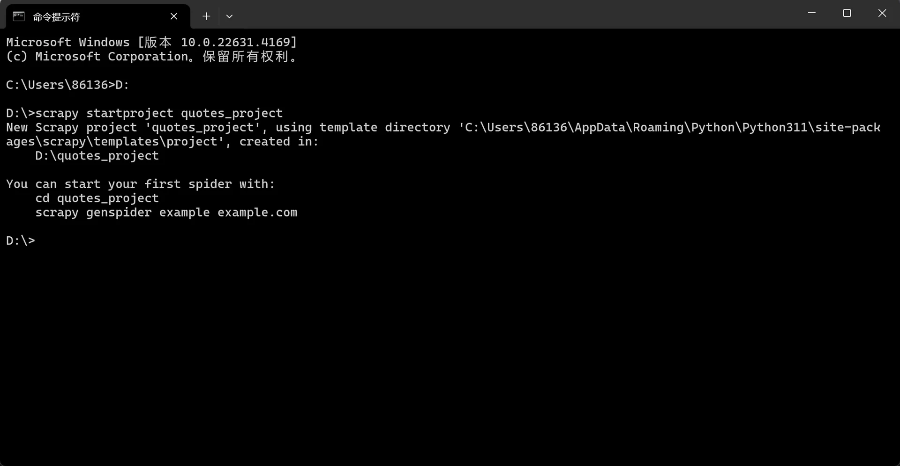

我们打开电脑D盘，会发现此时已经生成了一个名为quotes_project的文件夹，其目录结构如下所示：

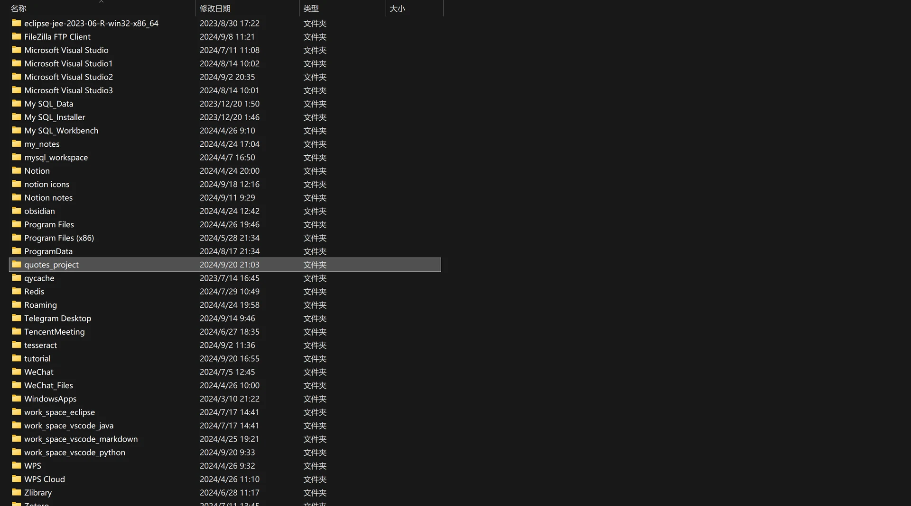

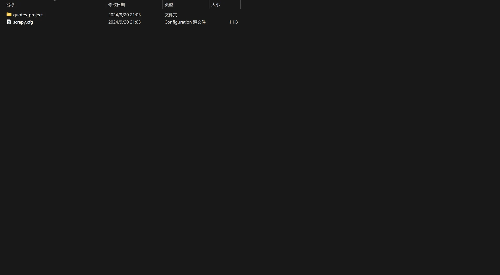

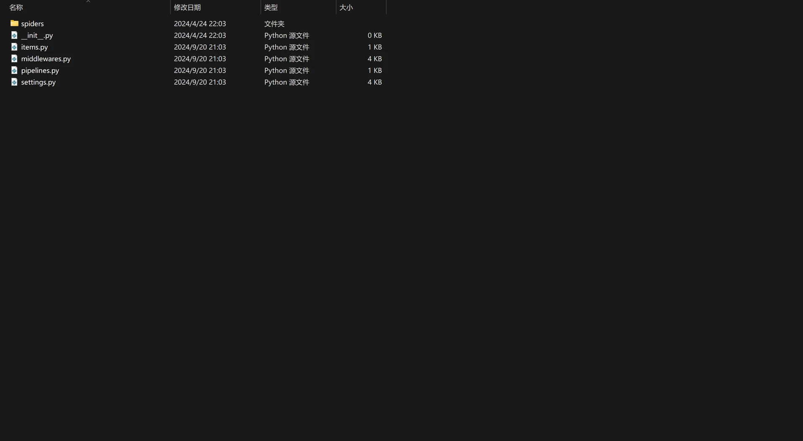

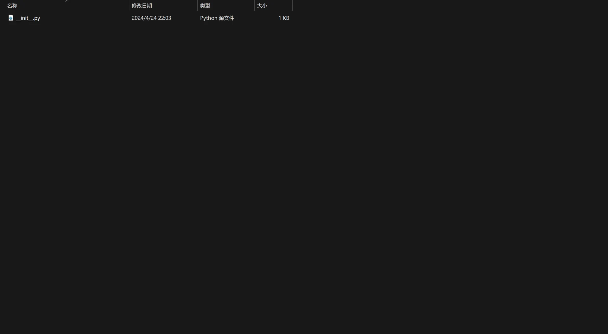

接下来需要在项目文件夹中生成一个Spider，Spider是我们自己定义的一个类，它在Scrapy中用于从网页中抓取所需要的内容并进行解析。但是这个类必须继承Scrapy提供的scrapy.Spider类，我们需要自己定义Spider的名称、初始请求以及如何处理爬取之后结果的方法。

我们现在通过命令行语句来创建一个Spider（注意要满足格式要求：scrapy genspider example example.com）。

```bash
cd quotes_project
scrapy genspider quotes https://quotes.toscrape.com/
```

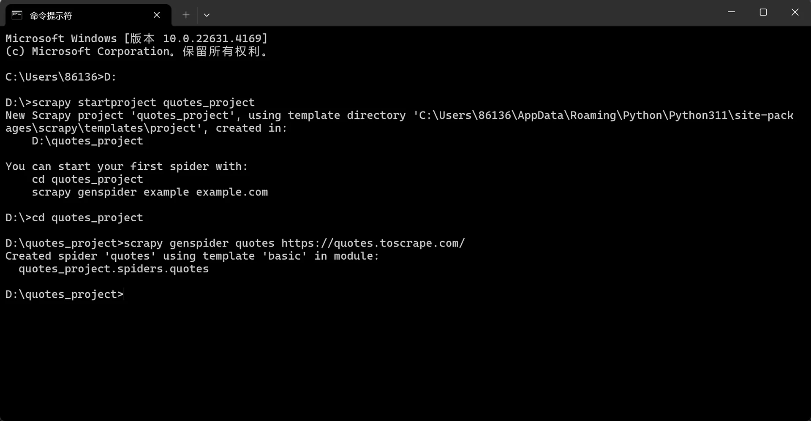

我们此时会发现项目文件夹中的子文件夹spiders中生成了一个名为“quotes.py”的文件。

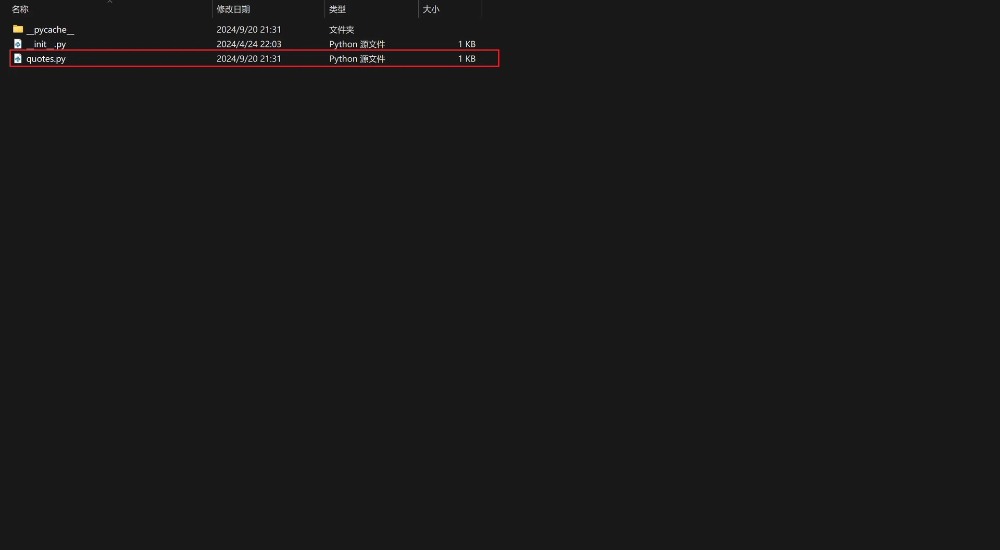

打开这个Python文件，我们能看到创建的QuotesSpider类中含有3个属性1个方法，分别为“name”、“allowed_domains”、“start_urls”以及“parse()”方法。

- “name”属性代表每个项目唯一的名字，用来区分不同的Spider；

- “allowed_domains”属性是允许爬取的域名，如果初始或后续的请求链接与该域名无关，请求链接就会被过滤掉；

- “start_urls”属性包含Spider在启动时爬取的URL列表，初始请求链接便是由其定义；

- “parse()”方法，在默认情况下，被调用时通过接收start_urls中的链接响应结果来解析返回的响应、提取数据或者进一步生成要处理的请求。

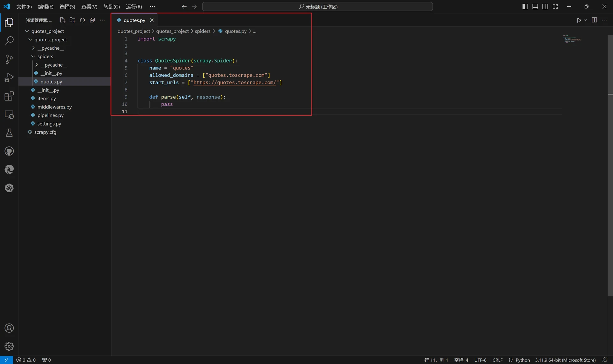

---

### 2.使用IDE编写爬取逻辑与程序

接下来我们需要创建Spider中的Item，Item是保存爬取数据的容器，它的使用方法与字典类似，但是它相比于字典多了额外的保护机制，可以有效避免拼写错误、定义字段错误等（更多有关Item的信息，请参见[**官方文档**](https://docs.scrapy.org/en/latest/topics/items.html)）。

我们首先观察一下Quotes网站的源代码，会发现主要的标签为“text”、“author”、“tags”。

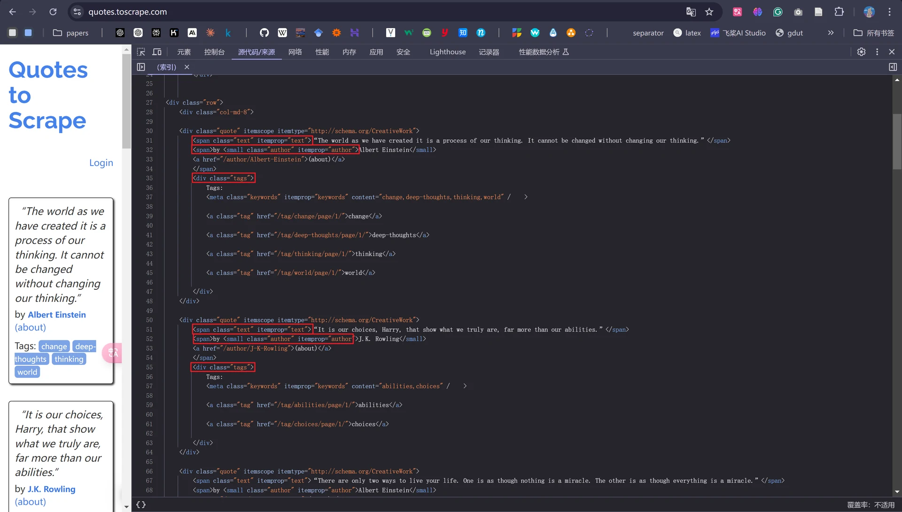

此时我们打开项目文件夹中的同名子文件夹，会发现里面有一个名为items.py的文件，使用本地的IDE或者记事本打开，将文件代码修改如下并保存。

```python
import scrapy

class QuoteProjectItem(scrapy.Item):
    text = scrapy.Field()
    author = scrapy.Field()
    tags = scrapy.Field()
```

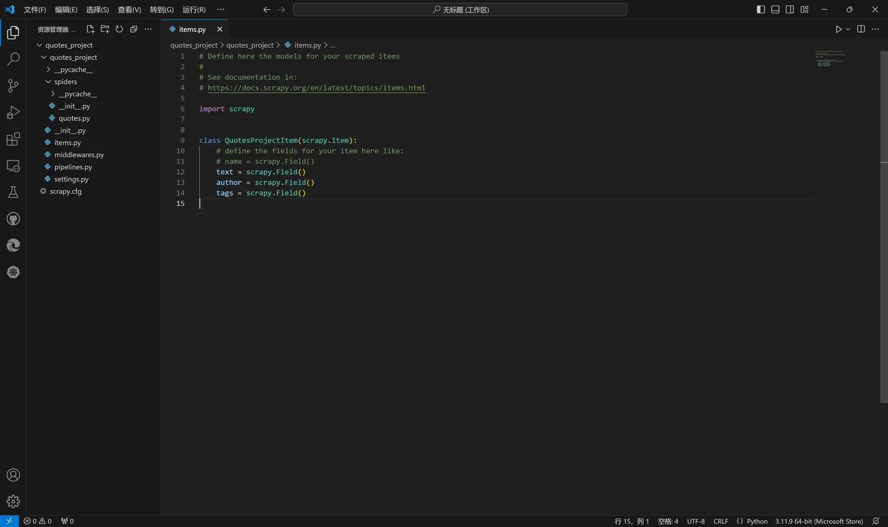

接着我们对前面提到的parse()解析方法进行编写，从网页源代码中不难看出，每一则名人名言的信息都包含在一个名为“quote”的class标签中，每个标签中又含有“text、author、tags”子标签；滑至源代码页面底部，会发现一个名为“next”的class标签用于控制网页的翻页，当我们在第一页的网页中点击“Next”后便会自动跳转至第二页，以此类推。

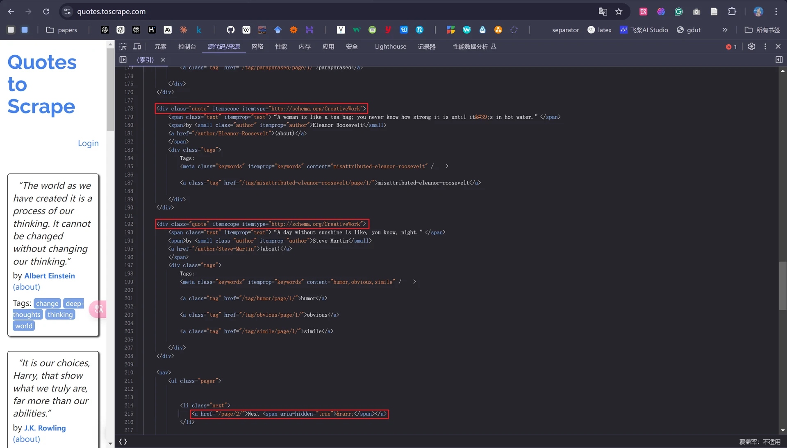

接下来我们就对quotes.py文件进行改写并用到先前创建的Item：

```python
import scrapy
from quotes_project.items import QuotesProjectItem # 从先前的items.py文件中导入我们创建好的Item

class QuotesSpider(scrapy.Spider):
    name = "quotes"
    allowed_domains = ["quotes.toscrape.com"]
    start_urls = ["https://quotes.toscrape.com/"]

    def parse(self, response):
        quotes = response.css('.quote') # 使用CSS选择器来对关键信息进行提取
        for quote in quotes: # 使用一个for循环对所有的quotes进行逐个遍历并解析每个quote的内容
            item = QuotesProjectItem()
            item['text'] = quote.css('.text::text').extract_first() # 使用".text"选择器选取text标签的内容（整个带标签的节点），使用extract_first()方法来获取内容中的正文（列表中的第一个元素）
            item['author'] = quote.css('.author::text').extract_first()
            item['tags'] = quote.css('.tags .tag::text').extract() # 由于我们需要获取所有的名言分类标签，故在此使用extract()方法获取整个列表内容
            yield item

        next = response.css('.pager .next a::attr("href")').extract_first() # 通过CSS选择器获取下一个页面的链接
        url = response.urljoin(next) # 使用urljoin()方法将相对路径URL构造成绝对路径URL（比如获取到的下一页地址为"/page/2/"，经过构造后得到的结果为"https://quotes.toscrape.com/page/2/"）
        yield scrapy.Request(url=url, callback=self.parse) # 通过url和callback变量构造新的请求，回调函数callback仍然使用parse()方法进行解析，不断翻页循环往复，直到最后一页的爬取
```

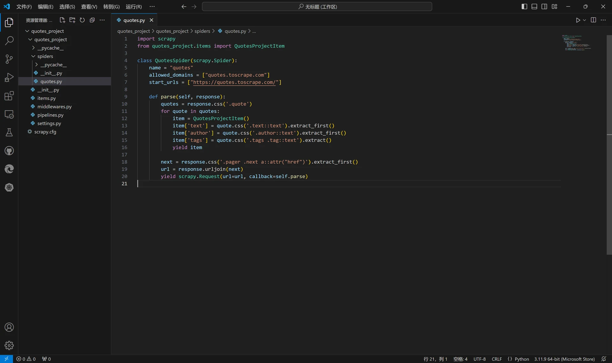

---

### 3.使用命令行进行爬取并导出结果

到这里我们就已经编写好了爬虫的爬取逻辑，现在打开命令行窗口并进入项目目录，运行如下命令后发现窗口出现正常运行信息即可。

```bash
scrapy crawl quotes
```

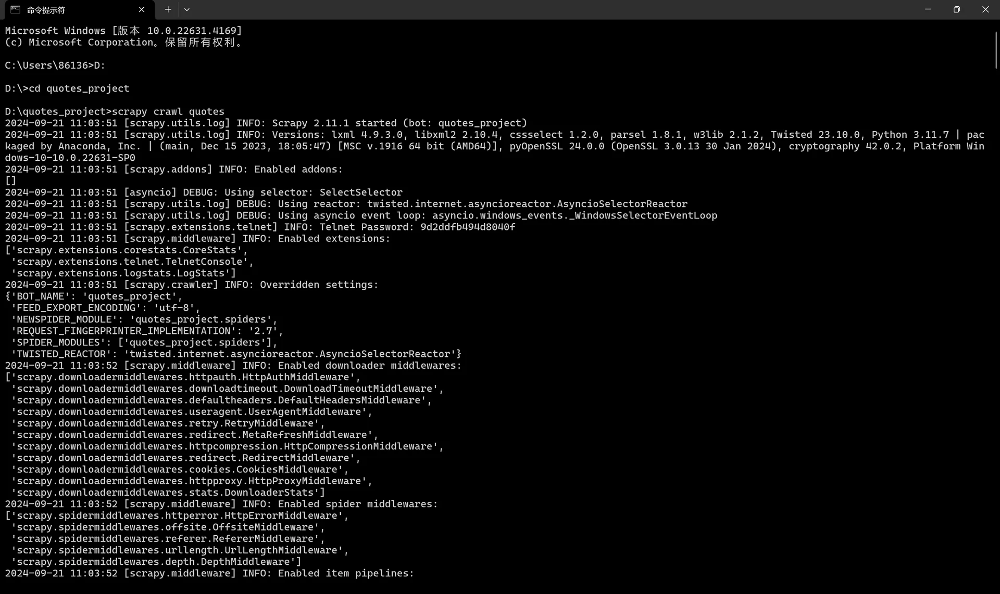

但是我们此时只在控制台看到输出结果的运行信息而并没有看到结果的具体信息，可以运行如下任意一条命令将结果保存为特定文件格式，并且可以在项目文件的父目录中找到它们。

```bash
scrapy crawl quotes -o quotes.json

scrapy crawl quotes -o quotes.csv

scrapy crawl quotes -o quotes.xml
```

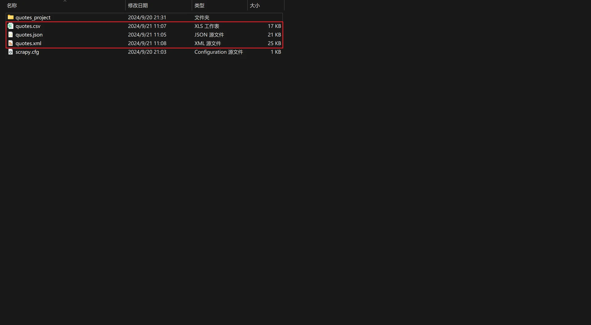

[quotes.json](scrapy-primary-information-crawling/quotes.json)

[quotes.csv](scrapy-primary-information-crawling/quotes.csv)

[quotes.xml](scrapy-primary-information-crawling/quotes.xml)

至此，我们就已经完成了对Quotes这个网站中的名人名言关键信息的批量爬取工作了💯。

---

## 二、某工管理学院官网教师信息爬取

我们首先在命令行创建一个名为gdutManagement的Scrapy项目，然后切换至该项目目录生成对应的Spider文件“gdut.py”（注意网址输入为[**https://glxy.gdut.edu.cn/szdw/qzjs.htm**](https://glxy.gdut.edu.cn/szdw/qzjs.htm)）。

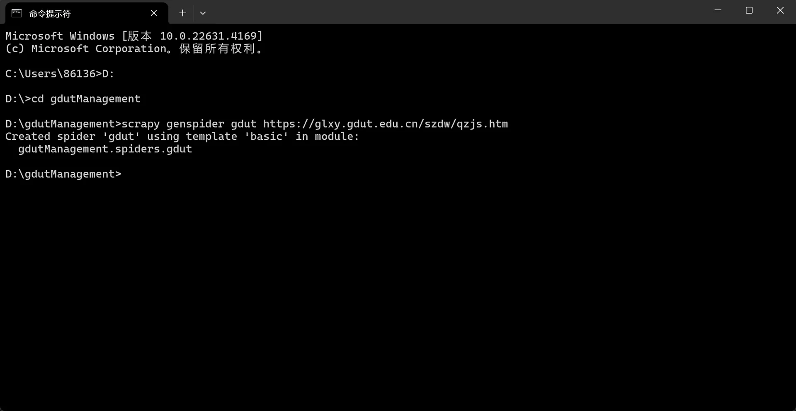

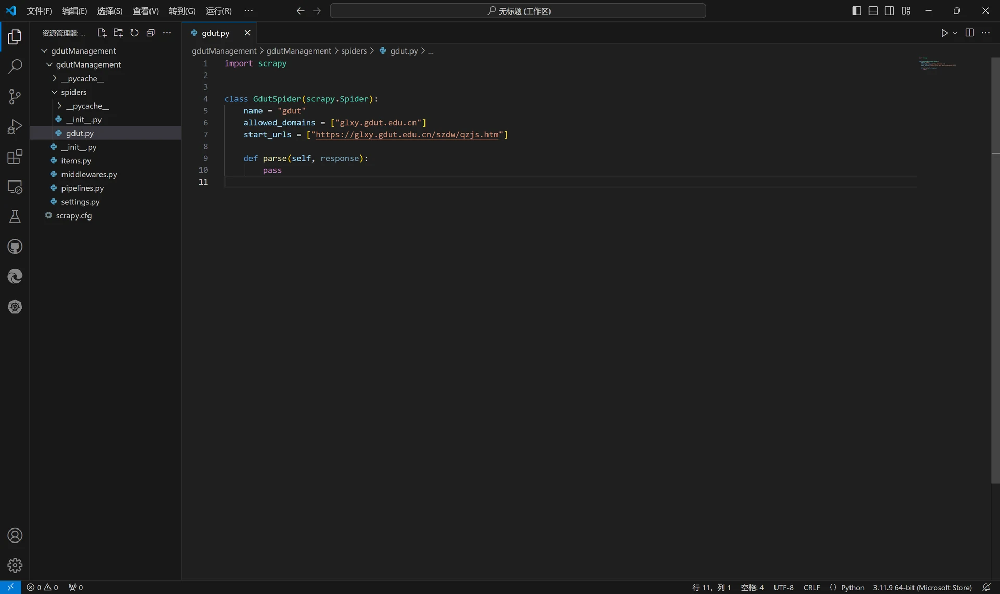

接着我们打开需要爬取的网址，进入源代码页面，查找我们需要的教师信息字段标签。

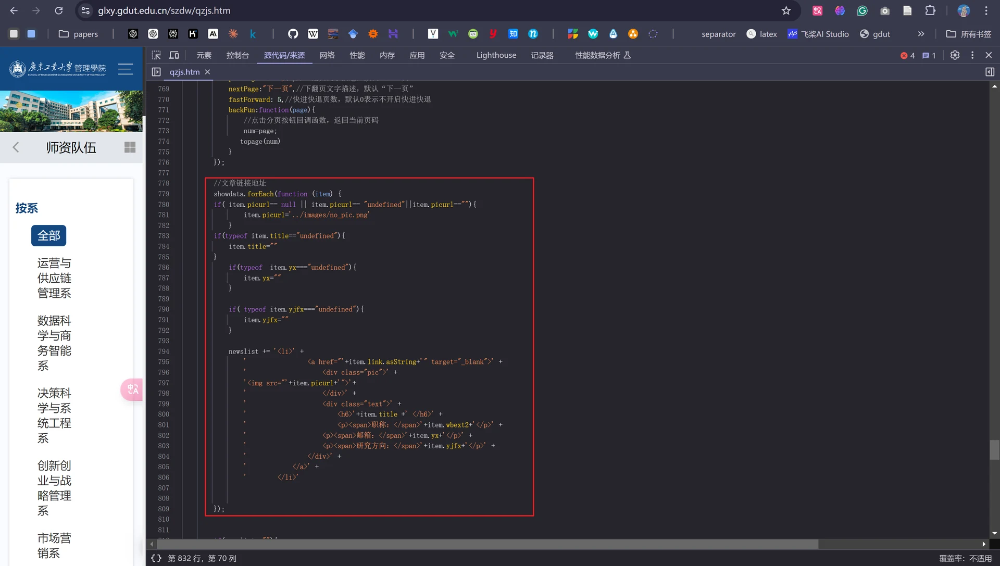

但是我们此时并没有发现官网所示的教师具体信息出现在源代码中！

继续查看源代码，发现学校官网的教师信息是动态生成的，通过JavaScript从JSON接口获取教师数据并渲染到页面上，因此我们直接爬取网页的HTML内容是无法得到教师的详细信息的。

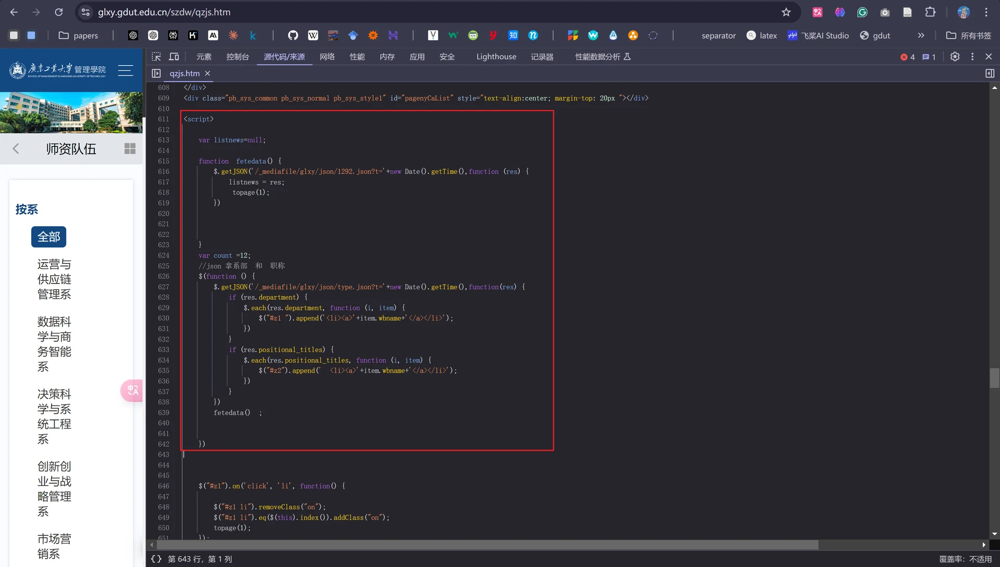

但是我们此时是知道教师信息是从如下两个JSON接口中获取的：

- **/mediafile/glxy/json/1292.json**:教师信息列表

- **/mediafile/glxy/json/type.json**:系别、职称列表

所以现在问题的关键就变成了如何找到这两个接口所在的JSON文件源。所幸这是学校官网，经过一段时间的尝试后，得到了这两个接口的文件源地址：

- [**https://glxy.gdut.edu.cn/_mediafile/glxy/json/1292.json**](https://glxy.gdut.edu.cn/_mediafile/glxy/json/1292.json)

- [**https://glxy.gdut.edu.cn/_mediafile/glxy/json/type.json**](https://glxy.gdut.edu.cn/_mediafile/glxy/json/type.json)

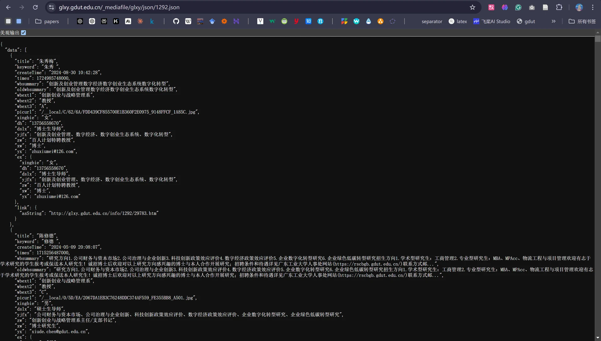

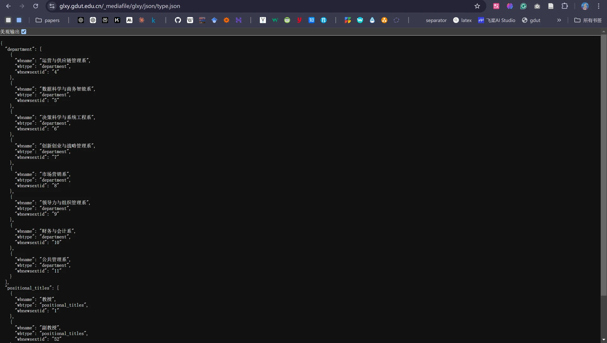

有了教师的详细信息，现在我们要做的就是利用Scrapy从JSON文件中爬取出我们想要的教师字段信息，我这里以**教师姓名**、**职称**、**邮箱**、**研究方向**和**详情链接**5个字段为例。根据JSON文件提供的教师数据格式，我们首先对item.py文件进行更新。

```python
import scrapy

class GdutmanagementItem(scrapy.Item):
    Name = scrapy.Field() # 姓名
    Position = scrapy.Field() # 职称
    Email = scrapy.Field() # 邮箱
    Research = scrapy.Field() # 研究方向
    Link = scrapy.Field() # 详情链接
```

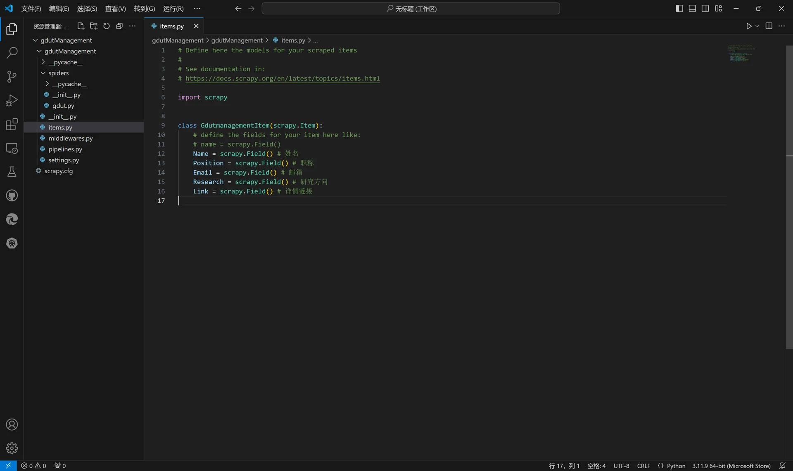

接着我们对Spider文件gdut.py进行更新以满足爬取逻辑。

```python
import scrapy
import json
from gdutManagement.items import GdutmanagementItem

class GdutSpider(scrapy.Spider):
    name = "gdut"
    allowed_domains = ["glxy.gdut.edu.cn"]
    start_urls = ["https://glxy.gdut.edu.cn/_mediafile/glxy/json/1292.json"] # 此时我们需要将原来的网址改为JSON文件的网址

    def parse(self, response):
        data = json.loads(response.text)
        for teacher in data.get('data', []):
            item = GdutmanagementItem()
            item['Name'] = teacher.get('title')
            item['Position'] = teacher.get('wbext2')
            item['Email'] = teacher.get('yx')
            item['Research'] = teacher.get('yjfx')
            item['Link'] = teacher.get('link').get('asString')
            yield item
```

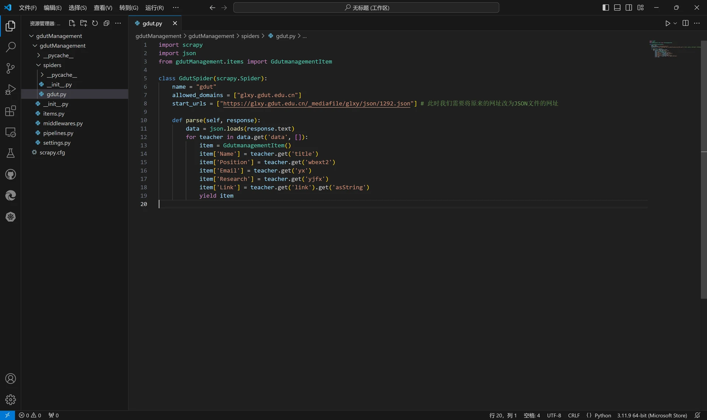

然后我们在命令行运行Scrapy爬取程序，出现如下页面即代表爬取成功。

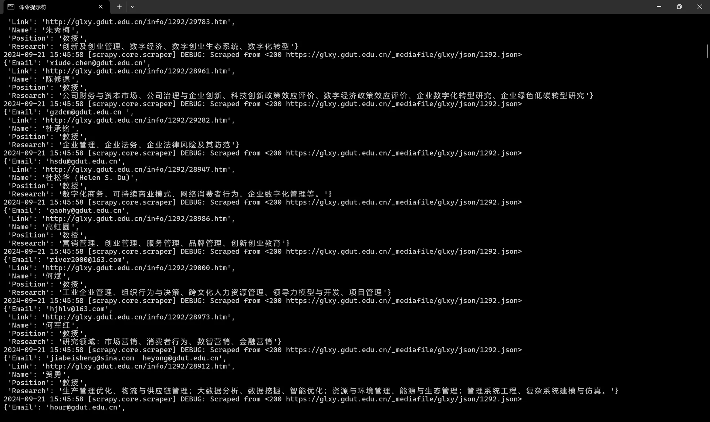

将爬取结果保存为特定格式文件，至此，我们对某工管理学院官网上的教师信息就全部爬取完成了，如果你感兴趣的话，不妨也来试试吧哈哈哈哈哈。

[teachers.json](scrapy-primary-information-crawling/teachers.json)

[teachers.csv](scrapy-primary-information-crawling/teachers.csv)

[teachers.xml](scrapy-primary-information-crawling/teachers.xml)

---

## 三、Scrapy项目总结

看到这里，我相信大家已经对Scrapy的用法不陌生了，和Pyspider同样作为爬虫框架的它将爬取实现高度集中化，我们只需要通过命令行输入简单的几行代码并对爬虫文件进行程序编写即可，虽然它没有像Pyspider那样的可视化操作界面，但是使用起来同样快捷方便，通过使用这两个库后我们能够深深体会到Python强大的功能库和简洁性。

笔记的最后我们来简单了解一下Scrapy的底层架构和工作原理。

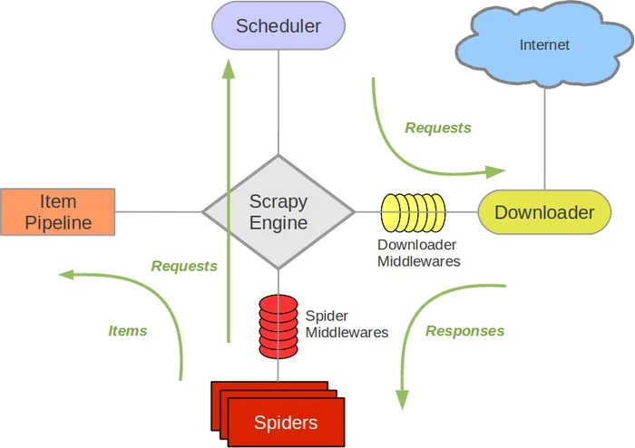

- Engine，用于处理整个系统的数据流以及触发事务，是整个系统的核心；

- Items，定义爬取结果的数据结构，我们爬取的数据会被赋值为该对象；

- Scheduler，用于接收Engine发来的请求并加入队列中，在引擎再次请求的时候返回给它；

- Downloader，用于下载爬取的网页内容，并将网页内容返回给Spider；

- Spiders，用于定义爬取的逻辑和网页的解析规则，主要负责响应并生成提取结果和新的请求；

- Item Pipeline，负责出理由Spider从网页中抽取的项目，主要任务为清洗、验证和存储数据；

- Downloader Middlewares，位于Engine和Downloader之间的架构，负责处理Engine与Downloader之间的请求与响应；

- Spider Middlewares，位于Engine和Spider之间的架构，负责处理Spider输入的响应、输出的结果和新的请求。

Scrapy中的数据流由Engine进行控制，其流动过程如下：

1. Engine首先打开一个网站，找到处理该网站的Spider并向该Spider请求第一个要爬取的URL；

2. Engine从Spider中获取到第一个要爬取的URL并通过Scheduler以Request的形式进行调度；

3. Engine向Scheduler请求下一个要爬取的URL；

4. Scheduler返回下一个要爬取的URL给Engine，Engine将URL通过Downloader Middlewares转发给Downloader下载；

5. 一旦页面下载完毕，Downloader生成一个该页面的Response，并将其通过Downloader Middlewares发送给Engine；

6. Engine从下载器中接收到Response并通过Spider Middlewares发送给Spider进行处理；

7. Spider处理Response并返回爬取到的Item以及新的Request给Engine；

8. Engine将Spider返回的Item给Item Pipeline，将新的Request给Scheduler；

9. 重复第2-8步，直到Scheduler中没有更多的Request，此时Engine关闭该网站，爬取结束。

---

关于Scrapy库的更多介绍请大家参见官方文档：[**https://docs.scrapy.org/en/latest/**](https://docs.scrapy.org/en/latest/)
