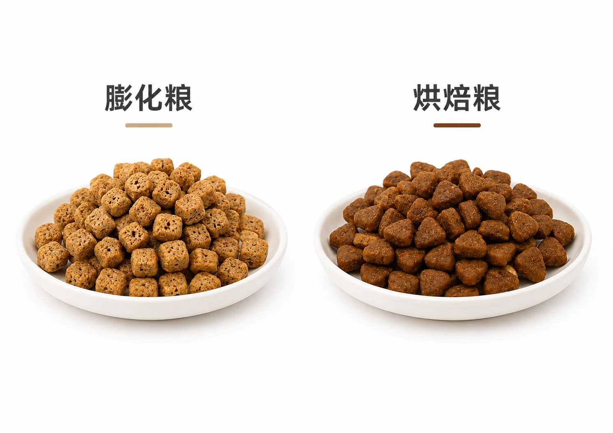
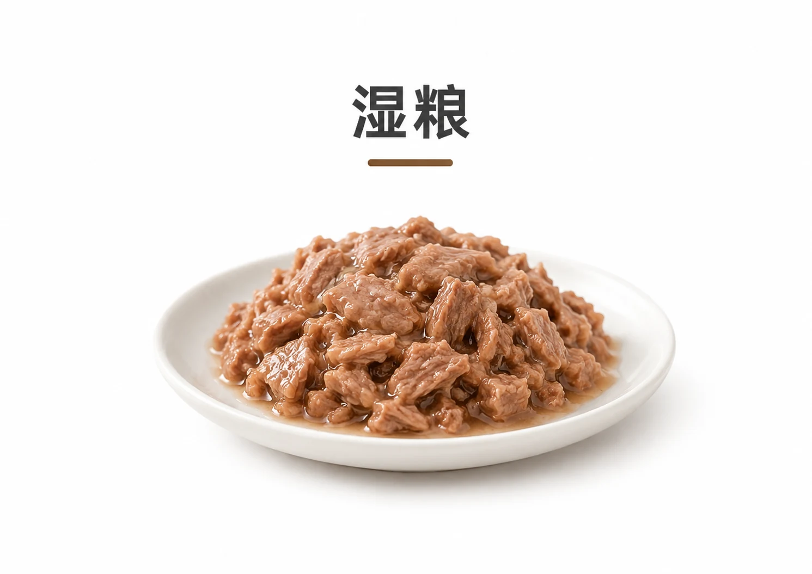
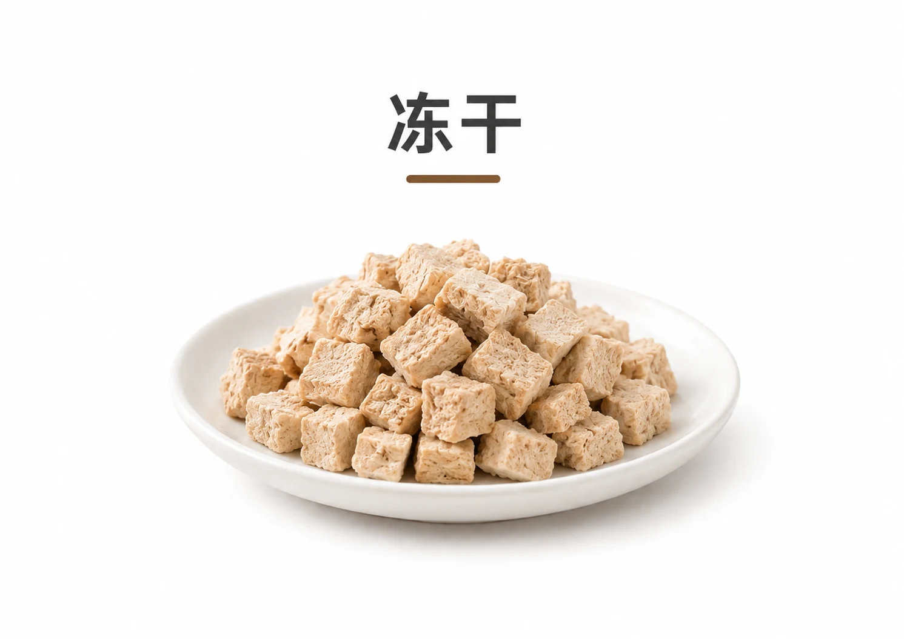

给猫主子挑选饭碗里的美味简直是每个铲屎官的日常必修课！走进宠物店或打开网购页面，五花八门的猫粮是不是让你挑花了眼？其实抛开那些令人眼花缭乱的噱头，市面上最常见、出场率最高的猫咪口粮无外乎就三大种类：**干粮、湿粮和冻干**。

这三种猫粮各有各的脾气和绝活：有的像香脆的小饼干，有的像多汁的豪华大餐，还有的则是锁住灵魂美味的营养炸弹。为了让我们的猫主子每天都能“光盘干饭”并且吃得健康又满足，接下来我们就来扒一扒这三位的真实面目、各自的拿手好戏以及怎么选才最对猫咪的胃口吧！

## 一、干粮

提到干粮，很多铲屎官脑海里浮现的可能就是那些嘎嘣脆的小颗粒。但你知道吗？同样是“脆脆饼”，里面的门道可大着呢！

目前市面上最主流的干粮主要分为两大阵营：**膨化粮**和**烘焙粮**，它们一个是主打高温挤压速成的经典工艺，一个是慢火低温烘烤的新晋网红。

### 膨化粮

膨化粮是目前市面上历史最悠久、普及率最高的一种猫粮类型，其生产工艺和产品特性具有以下几个明显的特点：

- **工艺原理**：采用**高温（通常 130℃ 至 200℃）、高压**的挤压工艺制作而成。原料混合为糊状后进入膨化机，在极高的温度和压力下熟化，随后在挤出模具的瞬间因压力骤降而膨胀成型，最后经过干燥和表面喷涂（通常为油脂或营养粉）处理制成。
- **成分与营养结构**：受限于膨化成型的物理工艺要求，配方中**必须包含一定比例的淀粉**（如谷物、薯类或豆类等碳水化合物）作为粘合剂，这意味着膨化粮的碳水化合物含量通常存在一个难以消除的下限；同时高温高压的加工过程**会不可避免地导致部分热敏性维生素和益生菌流失**，因此厂商通常需要在加工后期进行营养素补偿。
- **主要优势**
    - **性价比较高**：得益于极其成熟的工业化大规模生产线和较高的生产效率，生产成本相对较低，市场售价通常最为亲民。
    - **易于储存**：膨化工艺使颗粒的水分含量极低（通常在 10% 以下），防腐和抗霉变能力强、保质期较长，非常适合家庭日常储存和搭配自动喂食器使用。
    - **适口性较好**：颗粒表面经过油脂和风味物质的喷涂，能有效刺激猫咪的食欲。
- **潜在不足**：由于碳水化合物含量相对较高，长期单一食用低端膨化粮可能增加猫咪肥胖及相关代谢疾病的风险。此外，表面喷涂的油脂在接触空气后容易氧化，若猫咪食用后餐具未及时清洁，部分猫咪的下颌可能会**因油脂残留而引发局部毛囊炎（俗称“黑下巴”）**。

### 烘焙粮

烘焙粮是近年来在高端猫粮市场中迅速崛起的一种新型干粮，主打“低温慢烤”和“高鲜肉”概念，其主要特性如下：

- **工艺原理**：采用**低温（通常在 90℃ 到 110℃ 左右）长时间慢火烘烤**的加工方式。原料混合后不需要经过极端的温度和压力处理，而是直接压制切块后送入烤箱，在相对温和的环境下慢慢脱水熟化；此外，加工后期无需在颗粒表面进行额外的油脂喷涂工序。
- **成分与营养结构**：由于无需借助淀粉在高温高压下的膨化效应来成型，烘焙粮可以实现极低的碳水化合物添加，甚至可以做到“无淀粉”，这使其配方能够容纳更高比例的新鲜肉类，为猫咪提供更优质的动物源蛋白质和脂肪。同时低温慢烤工艺能有效减少对热敏性维生素、氨基酸等营养成分的破坏，锁住食材本味。
- **主要优势**
    - **营养密度与保留度高**：更接近纯肉的配方加上低温慢烤，最大程度保留了天然营养成分，整体营养密度普遍优于传统膨化粮。
    - **清爽干脆不油腻**：颗粒表面无需喷涂油脂，触感干爽、不易发生油脂氧化变质，能有效降低猫咪因接触氧化油脂而引发“黑下巴”的概率。
    - **更契合猫咪肉食天性**：极低的碳水含量与高肉含量更符合猫咪作为绝对肉食动物的消化道生理结构，有助于减少肠胃消化负担。
- **潜在不足**：烘焙粮的生产周期较长、产能较低，加之对鲜肉原料和设备工艺要求极高，导致其生产成本和市场售价普遍较昂贵。此外，由于颗粒密度较大且质地较硬，牙口不佳的老年猫或幼猫在咀嚼时可能略显费力；且因缺乏表面喷油和诱食剂的刺激，部分习惯了重口味膨化粮的猫咪在初期转换时可能会面临一定的适应期。

## 二、湿粮

湿粮（如主食罐头、餐包等）在高端喂养理念中占据着重要地位，其最显著的特征在于极高的含水量与更为天然的质地。

- **工艺原理**：通常是将鲜肉等原料绞碎、混合（有时会加入少许肉汤）灌装入密封容器（如马口铁罐、铝箔袋），然后经过高温高压灭菌处理（达到商业无菌标准）以实现常温下的长期保存。
- **成分与营养结构**：核心特点是**高含水量（通常在 70% 至 85% 之间）**，且主要成分为鲜肉或肉类副产品，通常不添加或仅添加极少量的碳水化合物；优秀的主食湿粮能够提供丰富的优质动物蛋白、脂肪以及充足的游离水分。
- **主要优势**
    - **高效补充水分**：极高的含水量能有效帮助猫咪通过日常饮食摄入充足水分，对不爱喝水的猫咪极为友好，**有助于预防泌尿系统结石、肾脏衰竭等下泌尿道系统疾病**。
    - **极佳的适口性与易消化性**：浓郁的天然肉香和柔软多汁的质地能极大激发猫咪食欲，同时高比例的动物源蛋白质减轻了胃肠道负担，对于幼猫、老年猫或牙口不佳的猫咪非常友好。
- **潜在不足**：湿粮的单位喂养成本较高，长期纯湿粮喂养对家庭预算有一定要求。此外湿粮开封后极易腐败变质，必须冷藏并在短时间内食用完毕；长期只进食软质食物可能不利于猫咪牙齿的物理摩擦清洁，需额外注意口腔护理。

## 三、冻干

冻干粮代表了目前猫粮生产工艺的顶尖水平，基本可以看作是“去除了水分的生肉”，被许多追求极致营养的铲屎官视为“终极口粮”。

- **工艺原理**：采用先进的真空冷冻干燥技术（FD 技术），首先将新鲜肉类在极低温度（通常为 -30℃ 至 -50℃）下快速冷冻，随后置于真空环境中缓慢加热，**使食材内部的冰晶不经过液态而是直接升华为水蒸气排出，最终实现彻底的脱水干燥**。
- **成分与营养结构**：由于不需要淀粉来帮助成型，也不需要防腐剂来延长保质期，冻干粮能够实现近乎 100% 的极高鲜肉含量（主食冻干会额外科学配比必需的维生素和矿物质）；水分被完全抽干，但食材的物理结构、蛋白质和风味物质被近乎完美地保留。
- **主要优势**
    - **营养保留最完整**：真空低温的加工环境极大程度避免了高温对蛋白质、热敏性维生素等营养素的破坏，营养密度极高，可以说是最接近生肉原貌的商业粮。
    - **出色的复水性与适口性**：质地疏松多孔，加温水后能迅速吸收水分还原成鲜肉状态，既可干喂又可复水喂食；同时因完整保留了肉类的天然风味，深受绝大多数猫咪的喜爱。
- **潜在不足**：冻干工艺复杂且耗时耗能，导致其生产成本极高，市场售价在所有猫粮类型中处于最高梯队。此外，由于营养极度浓缩且蛋白质、脂肪含量极高，肠胃功能较弱的猫咪在初次尝试或过量食用时容易出现消化不良甚至软便等现象，需要循序渐进地进行喂食。

## 总结

| 对比维度 | 膨化粮 | 烘焙粮 | 湿粮 | 冻干 |
| --- | --- | --- | --- | --- |
| 所属类别 | 干粮 | 干粮 | 湿粮 | 冻干 |
| 核心工艺 | 高温高压挤压膨化（约 130–200℃） | 低温慢火烘烤（约 90–110℃） | 鲜肉灌装后高温高压灭菌 | 真空冷冻干燥，-30～-50℃ 急冻后升华脱水 |
| 含水量 | 极低（10% 以下） | 低 | 高（70%～85%） | 极低（近乎完全脱水） |
| 碳水含量 | 较高（需淀粉粘合，存在下限） | 极低（可做到无淀粉） | 极低（几乎不添加） | 极低（无需淀粉成型） |
| 营养密度与保留程度 | 一般，高温会导致部分营养流失，需后期补偿 | 较高，高鲜肉配方、低温锁鲜 | 较高，优质动物蛋白、充足游离水分 | 最高，近乎完整保留，最接近生肉原貌 |
| 适口性 | 较好，表面喷涂油脂增香 | 干爽清脆，无喷油，部分猫需适应 | 极佳，肉香浓郁、柔软多汁 | 出色，保留天然肉味，可干喂或复水 |
| 储存与便利 | 最便利，保质期长，适配自动喂食器 | 较便利，干燥易存，不易油脂氧化 | 较费心，开封后需冷藏并尽快食用 | 便利，脱水耐存，无需防腐剂 |
| 价格梯队 | 最亲民，性价比高 | 偏高 | 偏高，单位喂养成本较高 | 最高 |
| 适合场景与注意 | 日常经济喂养；注意控碳防胖、勤洗餐具防“黑下巴” | 追求高营养；老幼猫咀嚼略费力，换粮需循序过渡 | 不爱喝水、幼猫／老年猫／牙口不佳；注意口腔护理 | 追求极致营养；肠胃较弱者需循序渐进，切忌过量 |

其实**干粮、湿粮和冻干并没有绝对的“王者”，适合自家主子的才是最好的**——关键得看猫咪的年龄、体质和口味偏好，再结合自己的预算与喂养习惯综合考量。

真正聪明的“干饭哲学”往往不是非此即彼的单选题，而是取长补短的混搭题——把不同猫粮按需搭配、干湿结合，既能照顾适口性、补足水分，又能均衡营养、丰富口感。说到底，**不是最贵的才是最好的，能让主子吃得开心、健健康康地长久“光盘”，才是每位铲屎官最大的勋章。**

愿大家早日摸透这猫碗里的小学问，让自家主子的“干饭之路”越走越香！
